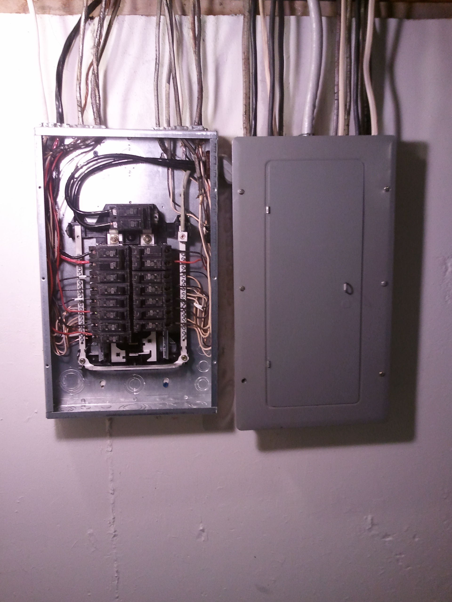
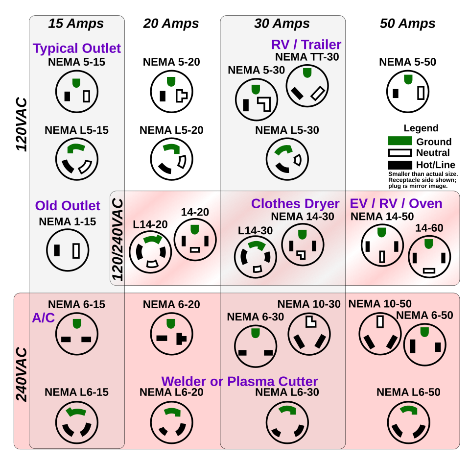
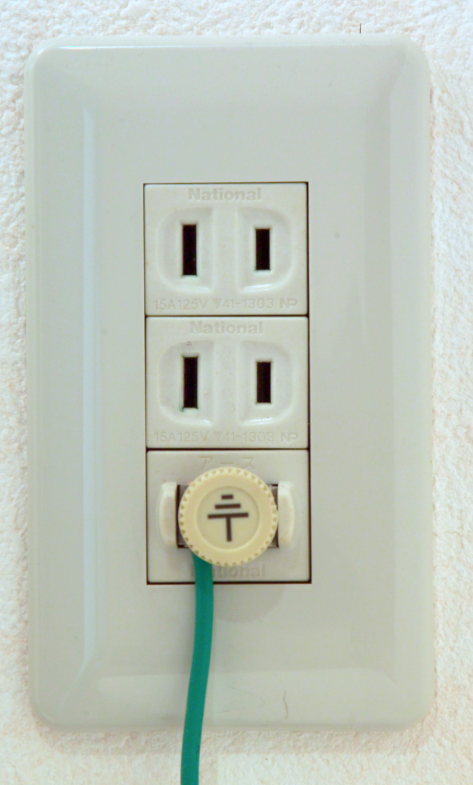
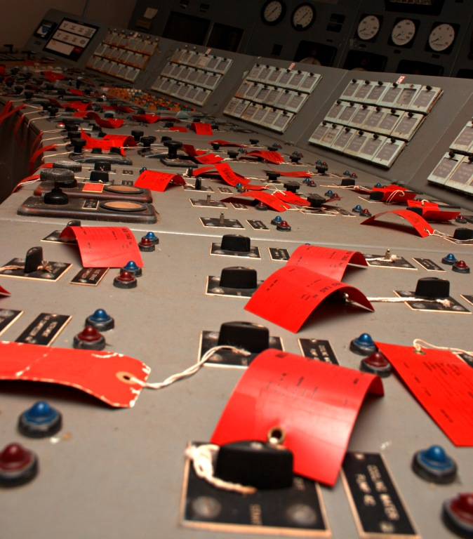
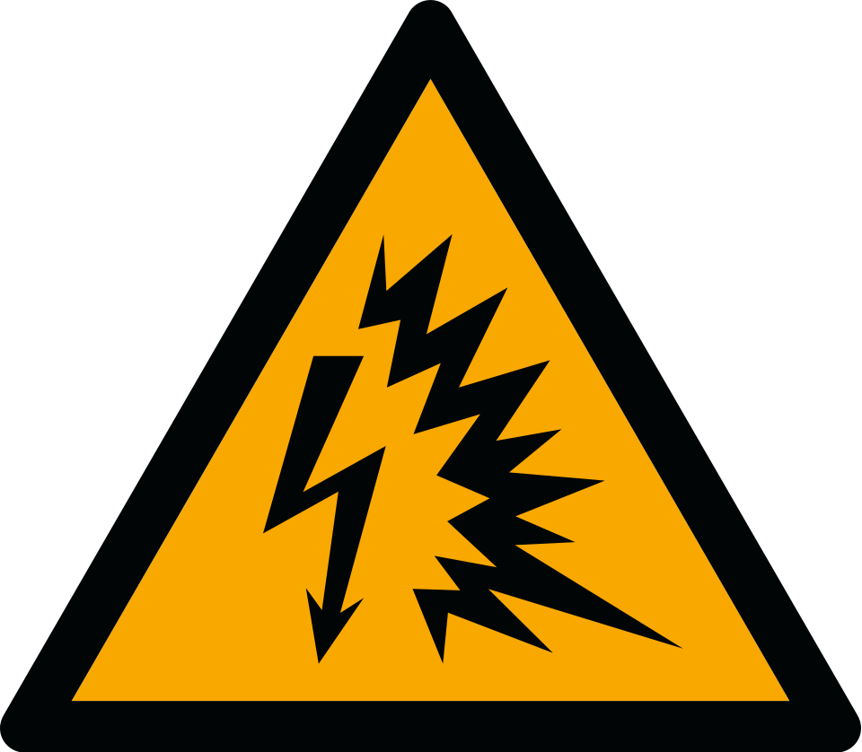
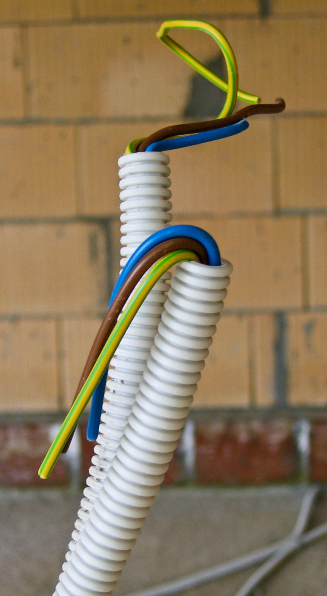
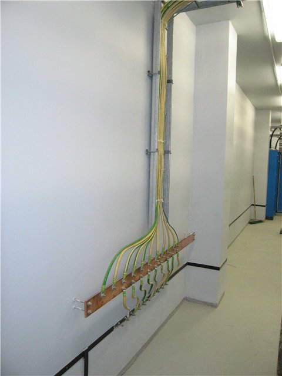

# Bloque 1: Normalización Eléctrica, Seguridad y Simbología

## Presentación del bloque

El Bloque 1 introduce al estudiante en los fundamentos técnicos, normativos y gráficos necesarios para interpretar instalaciones eléctricas civiles e industriales. En esta etapa se estudia la importancia de la normalización eléctrica, el uso de simbología técnica, la identificación de componentes en planos eléctricos y la aplicación de criterios de seguridad en laboratorio y obra.

Una instalación eléctrica no debe entenderse únicamente como la conexión de cables, interruptores, luminarias y tomacorrientes. En términos técnicos, es un sistema integrado que permite transportar, distribuir, proteger, controlar y utilizar la energía eléctrica de manera segura, eficiente y conforme a normas.

::: {.callout-note}
Este bloque constituye la base para los siguientes temas de la asignatura: diagramas eléctricos, instrumentación, mediciones eléctricas y automatización industrial.
:::

## Resultado de aprendizaje del bloque

Al finalizar este bloque, el estudiante interpreta planos eléctricos, reconoce simbología normalizada y componentes de instalaciones eléctricas civiles e industriales conforme a normas técnicas vigentes. Además, aplica normas de seguridad eléctrica y protocolos de laboratorio, identificando riesgos eléctricos y proponiendo medidas de prevención en actividades prácticas y entornos reales.

## Objetivo específico del bloque

Comprender y aplicar los fundamentos de las instalaciones eléctricas civiles e industriales, incorporando la normalización eléctrica, las normas técnicas y la simbología eléctrica, para la correcta interpretación de planos eléctricos y la ejecución de actividades bajo criterios de seguridad en laboratorios y entornos eléctricos.

---

# 1.1 Introducción a las instalaciones eléctricas civiles e industriales

## Concepto general de instalación eléctrica

Una instalación eléctrica es el conjunto de elementos destinados a conducir, distribuir, proteger, controlar y utilizar la energía eléctrica dentro de una edificación o sistema productivo.

Está conformada por acometida, medidor, tablero general, tableros secundarios, protecciones, conductores, canalizaciones, cajas de paso, interruptores, tomacorrientes, luminarias, cargas especiales, sistema de puesta a tierra, planos y diagramas técnicos.

En una edificación, la instalación eléctrica debe permitir que la energía llegue desde el punto de suministro hasta cada carga de manera segura y funcional.

{#fig-panel-residencial width=70%}

**Fuente de imagen:** Wikimedia Commons, archivo *Electrical panel and subpanel with cover removed from subpanel.jpg*, autor Gvolk, licencia CC BY-SA 3.0. Disponible en: <https://commons.wikimedia.org/wiki/File:Electrical_panel_and_subpanel_with_cover_removed_from_subpanel.jpg>

La @fig-panel-residencial permite observar un tablero residencial con interruptores automáticos. En una instalación real, el tablero concentra protecciones, organiza circuitos y facilita la operación y mantenimiento.

## Instalaciones eléctricas civiles

Las instalaciones civiles se encuentran en edificaciones destinadas a vivienda, comercio, educación, salud, oficinas, servicios públicos y espacios similares.

| Tipo de carga | Ejemplos |
|---|---|
| Iluminación | Luminarias interiores, exteriores, decorativas y de emergencia |
| Tomacorrientes | Equipos domésticos, computadores, cargadores, electrodomésticos menores |
| Cargas especiales | Cocina eléctrica, ducha eléctrica, calefón, aire acondicionado, bomba de agua |
| Servicios complementarios | Porteros eléctricos, alarmas, cámaras, redes de comunicación |

## Instalaciones eléctricas industriales

Las instalaciones industriales se aplican en procesos productivos, talleres, plantas de manufactura, sistemas electromecánicos y entornos donde existen cargas de potencia, control e instrumentación.

| Tipo de carga | Ejemplos |
|---|---|
| Cargas de fuerza | Motores, bombas, compresores, ventiladores |
| Cargas de control | Contactores, relés, temporizadores, PLC |
| Cargas de instrumentación | Sensores, transmisores, indicadores |
| Cargas de iluminación industrial | Luminarias de nave, reflectores, alumbrado de emergencia |
| Sistemas auxiliares | Tableros, bancos de capacitores, variadores de frecuencia |

## Tabla 1.1. Diferencias entre instalaciones civiles e industriales

| Criterio | Instalaciones civiles | Instalaciones industriales |
|---|---|---|
| Uso principal | Vivienda, comercio y servicios | Producción, control y operación de maquinaria |
| Tipo de cargas | Iluminación, tomacorrientes y cargas especiales | Motores, tableros de control, sensores y actuadores |
| Nivel de potencia | Bajo a medio | Medio a alto |
| Complejidad técnica | Moderada | Alta |
| Documentos frecuentes | Plano eléctrico, cuadro de cargas, diagrama unifilar | Diagramas de potencia, control, mando, PLC e instrumentación |
| Riesgos principales | Choque eléctrico, sobrecarga, mala puesta a tierra | Arco eléctrico, fallas de motor, arranque de cargas, fallas de control |
| Mantenimiento | Correctivo y preventivo básico | Preventivo, predictivo y correctivo especializado |

::: {.callout-important}
La principal diferencia entre una instalación civil y una industrial no es únicamente el tamaño, sino el tipo de carga, el nivel de control, la criticidad operativa y los riesgos asociados.
:::

---

# 1.2 Importancia de la normalización eléctrica

## ¿Qué es la normalización eléctrica?

La normalización eléctrica es el conjunto de reglas, criterios, símbolos, procedimientos y requisitos técnicos que permiten diseñar, construir, operar e inspeccionar instalaciones eléctricas bajo parámetros comunes.

Su finalidad es evitar interpretaciones ambiguas y reducir riesgos técnicos. La normalización permite:

1. Garantizar condiciones mínimas de seguridad.
2. Unificar criterios entre diseñadores, constructores, instaladores y fiscalizadores.
3. Facilitar la lectura de planos eléctricos.
4. Definir características mínimas de materiales y equipos.
5. Reducir el riesgo de incendios de origen eléctrico.
6. Facilitar el mantenimiento y ampliación de instalaciones.
7. Proteger a usuarios, equipos y edificaciones.

## Tabla 1.2. Problemas frecuentes por falta de normalización

| Problema | Consecuencia técnica | Riesgo asociado |
|---|---|---|
| Símbolos no normalizados | Mala interpretación del plano | Conexiones incorrectas |
| Conductores sin código de color | Dificultad para identificar fase, neutro y tierra | Choque eléctrico |
| Tableros sin rotulación | Mantenimiento inseguro | Desconexión incorrecta |
| Circuitos sin identificación | Confusión en operación y mantenimiento | Sobrecarga o mal aislamiento |
| Ausencia de cuadro de cargas | Selección deficiente de protecciones | Calentamiento o incendio |
| No considerar puesta a tierra | Fallas peligrosas en carcasas metálicas | Contacto indirecto |

## Ejemplo aplicado

Si en un plano residencial se representa un tomacorriente común y una salida para cocina eléctrica usando el mismo símbolo, el instalador podría utilizar el mismo conductor y la misma protección en ambos puntos. Esto generaría un riesgo, porque la cocina eléctrica requiere circuito especial, mayor capacidad de corriente y protección independiente.

---

# 1.3 Normas técnicas aplicadas a instalaciones eléctricas

## Normativa principal

En Ecuador, una referencia fundamental para instalaciones eléctricas en edificaciones es la **NEC-SB-IE Instalaciones Eléctricas**, perteneciente a la Norma Ecuatoriana de la Construcción. Esta norma se enfoca en instalaciones eléctricas interiores residenciales y establece criterios mínimos de diseño y seguridad.

La instalación debe proteger frente a choques eléctricos, efectos térmicos, sobrecorrientes, corrientes de falla y sobrevoltajes.

## Tabla 1.3. Normas y documentos técnicos de referencia

| Norma / documento | Aplicación en el módulo |
|---|---|
| NEC-SB-IE Instalaciones Eléctricas | Diseño y ejecución de instalaciones eléctricas interiores residenciales |
| NFPA 70 / National Electrical Code | Criterios de seguridad, protecciones, conductores y canalizaciones |
| CPE INEN 019 | Código Eléctrico Ecuatoriano |
| IEC 60617 | Simbología gráfica para diagramas eléctricos |
| NTE INEN 2345 | Alambres y cables con aislamiento termoplástico |
| NTE INEN 3098 | Voltajes normalizados |
| IEC 60364 | Instalaciones eléctricas en edificaciones |
| Reglamentos de empresas distribuidoras | Acometidas, medidores y requisitos de conexión |

::: {.callout-note}
Cuando existan diferencias entre documentos técnicos, se debe revisar la normativa nacional vigente, los requisitos de la empresa distribuidora y las especificaciones del proyecto.
:::

## Relación entre norma, plano y ejecución

Una instalación eléctrica segura requiere coherencia entre normativa aplicable, memoria técnica, plano eléctrico, cuadro de cargas, diagrama unifilar, selección de materiales, ejecución en obra e inspección final.

---

# 1.4 Simbología eléctrica normalizada

## Concepto

La simbología eléctrica normalizada permite representar gráficamente los componentes de una instalación eléctrica. Un símbolo eléctrico resume información técnica sobre el tipo de dispositivo, su función y su ubicación dentro del sistema.

Los símbolos se emplean en planos eléctricos en planta, diagramas unifilares, diagramas multifilares, diagramas de control, diagramas de potencia, planos de tableros y esquemas de automatización.

{#fig-simbologia-iec width=90%}

**Fuente de imagen:** Wikimedia Commons, archivo *Electrical Symbols IEC.svg*, autor Emareg, licencia CC0 1.0. Disponible en: <https://commons.wikimedia.org/wiki/File:Electrical_Symbols_IEC.svg>

La @fig-simbologia-iec muestra una colección de símbolos eléctricos IEC. Esta referencia permite comprender por qué la representación gráfica debe ser consistente, legible y verificable.

## Tabla 1.4. Simbología básica para instalaciones civiles

| Elemento | Representación textual sugerida | Función |
|---|---|---|
| Punto de luz | PL | Salida para luminaria |
| Interruptor simple | S1 | Control de una luminaria desde un punto |
| Interruptor doble | S2 | Control de dos luminarias o grupos |
| Tomacorriente simple | T1 | Alimentación de carga de uso general |
| Tomacorriente doble | T2 | Alimentación de dos equipos |
| Tomacorriente con tierra | TT | Alimentación con conductor de protección |
| Salida especial | SE | Alimentación de carga específica |
| Tablero de distribución | TD | Agrupación de protecciones |
| Medidor | M | Registro de energía |
| Puesta a tierra | PT | Conexión de seguridad a tierra |

## Tabla 1.5. Simbología básica para instalaciones industriales

| Elemento | Código frecuente | Función |
|---|---|---|
| Motor | M | Convierte energía eléctrica en mecánica |
| Contactor | KM | Maniobra eléctrica de cargas |
| Relé térmico | FR | Protección contra sobrecarga en motores |
| Pulsador de marcha | S1 / START | Orden de encendido |
| Pulsador de paro | S0 / STOP | Orden de apagado |
| Lámpara piloto | H | Señalización visual |
| Final de carrera | SQ | Detección de posición |
| Sensor | B | Detección de variable física |
| PLC | PLC | Control lógico programable |
| Fuente de alimentación | PS | Alimentación de circuitos de control |

## Criterios de representación

Para que la simbología sea técnicamente correcta, debe ser legible, estar incluida en una leyenda, mantenerse igual en todo el plano, diferenciar cargas normales y especiales, identificar circuitos y relacionarse con el cuadro de cargas.

---

# 1.5 Identificación de símbolos eléctricos en planos

## Lectura de planos eléctricos

Un plano eléctrico es un documento técnico que representa la ubicación y conexión de elementos eléctricos dentro de una edificación.

En instalaciones civiles, el plano eléctrico se suele elaborar sobre la planta arquitectónica. Sobre ella se ubican luminarias, interruptores, tomacorrientes, salidas especiales, tablero y canalizaciones.

## Elementos mínimos de un plano eléctrico residencial

| Elemento | Descripción | Importancia |
|---|---|---|
| Planta arquitectónica | Base gráfica de la vivienda | Permite ubicar ambientes y recorridos |
| Puntos de iluminación | Luminarias interiores y exteriores | Define circuitos de alumbrado |
| Interruptores | Dispositivos de control | Permiten maniobra de luminarias |
| Tomacorrientes | Salidas de uso general | Alimentan equipos portátiles |
| Cargas especiales | Cocina, ducha, calefón, bomba | Requieren circuitos independientes |
| Tablero | Centro de distribución | Aloja protecciones |
| Canalizaciones | Recorrido de conductores | Define ejecución física |
| Cuadro de cargas | Resumen de potencia y corriente | Permite dimensionamiento |
| Diagrama unifilar | Esquema general del sistema | Muestra jerarquía eléctrica |
| Leyenda | Símbolos utilizados | Facilita interpretación |

{#fig-nema width=85%}

**Fuente de imagen:** Wikimedia Commons, archivo *NEMA simplified pins.svg*, autor Orion Lawlor, licencia indicada en la página del archivo. Se usa una previsualización PNG generada por Wikimedia. Disponible en: <https://commons.wikimedia.org/wiki/File:NEMA_simplified_pins.svg>

La @fig-nema ayuda a identificar la función de los pines en diferentes configuraciones de tomacorrientes. En planos eléctricos, las salidas especiales deben diferenciarse de los tomacorrientes de uso general.

{#fig-tomacorriente-tierra width=45%}

**Fuente de imagen:** Wikimedia Commons, archivo *OutletGround.jpg*, autor Fg2, dominio público. Disponible en: <https://commons.wikimedia.org/wiki/File:OutletGround.jpg>

La @fig-tomacorriente-tierra ilustra un tomacorriente con punto de tierra. En instalaciones residenciales, los tomacorrientes deben considerar protección y polarización adecuada según el tipo de carga y ambiente de uso.

## Procedimiento recomendado para interpretar un plano eléctrico

1. Identificar la planta arquitectónica.
2. Localizar el tablero de distribución.
3. Reconocer la simbología utilizada.
4. Revisar los circuitos de iluminación.
5. Revisar los circuitos de tomacorrientes.
6. Identificar cargas especiales.
7. Verificar recorridos de canalización.
8. Revisar el cuadro de cargas.
9. Comparar el plano con el diagrama unifilar.
10. Confirmar la existencia de sistema de puesta a tierra.

::: {.callout-tip}
Todo símbolo colocado en planta debe tener respaldo en la leyenda y, cuando corresponda, en el cuadro de cargas.
:::

---

# 1.6 Normas de seguridad eléctrica y uso de laboratorios eléctricos

## Seguridad eléctrica

La seguridad eléctrica consiste en aplicar medidas preventivas para evitar daños a las personas, equipos e instalaciones. En instalaciones eléctricas, el riesgo no solo aparece por contacto directo con conductores energizados, sino también por fallas de aislamiento, conexiones deficientes, sobrecargas, ausencia de puesta a tierra o protecciones mal seleccionadas.

## Seguridad en laboratorio

El laboratorio eléctrico es un espacio de aprendizaje experimental. Sin embargo, al trabajar con tensión, corriente y equipos de medición, se deben cumplir reglas estrictas.

## Tabla 1.6. Reglas básicas de seguridad en laboratorio

| Regla | Aplicación práctica |
|---|---|
| Revisar el circuito antes de energizar | Verificar conexiones según el diagrama |
| Confirmar ausencia de tensión | Usar multímetro antes de manipular |
| Seleccionar escala correcta | Evitar daño del instrumento |
| Usar cables en buen estado | Evitar falsos contactos o cortocircuitos |
| No dejar conductores expuestos | Prevenir choque eléctrico |
| Energizar solo con autorización | Mantener control docente |
| Desenergizar antes de modificar | Evitar conexiones bajo tensión |
| Mantener orden en la mesa | Reducir errores de conexión |
| No improvisar puentes | Respetar el esquema de trabajo |
| Reportar fallas de equipos | Prevenir accidentes |

{#fig-multimetro width=55%}

**Fuente de imagen:** Wikimedia Commons, archivo *Digital Multimeter (To measure Voltage, Current and Resistance).jpg*, autor K.Venkataramana, licencia CC0 1.0. Disponible en: <https://commons.wikimedia.org/wiki/File:Digital_Multimeter_(To_measure_Voltage,_Current_and_Resistance).jpg>

La @fig-multimetro muestra un instrumento básico para mediciones eléctricas. Su uso exige seleccionar correctamente magnitud, escala, puntas de prueba y forma de conexión.

## Tabla 1.7. Uso básico del multímetro

| Magnitud | Posición del instrumento | Forma de conexión | Condición de seguridad |
|---|---|---|---|
| Voltaje | V AC / V DC | En paralelo | Circuito energizado con cuidado |
| Corriente | A / mA | En serie | Revisar escala y borne correcto |
| Resistencia | Ω | En paralelo al elemento | Circuito desenergizado |
| Continuidad | Símbolo de buzzer | Entre dos puntos | Circuito desenergizado |

::: {.callout-warning}
Nunca se debe medir resistencia o continuidad en un circuito energizado. Esta acción puede dañar el instrumento y poner en riesgo al usuario.
:::

{#fig-lockout width=75%}

**Fuente de imagen:** Wikimedia Commons, archivo *Lockout.jpg*, autor Gregory Maxwell, licencia GFDL 1.2. Disponible en: <https://commons.wikimedia.org/wiki/File:Lockout.jpg>

La @fig-lockout muestra controles etiquetados para evitar accionamientos no previstos. En obra e industria, el bloqueo y etiquetado reduce el riesgo de energización accidental durante mantenimiento.

---

# 1.7 Riesgos eléctricos y medidas de prevención

## Concepto de riesgo eléctrico

Un riesgo eléctrico es la posibilidad de que una persona, equipo o instalación sufra daño debido a la presencia de energía eléctrica en condiciones inseguras.

Los riesgos eléctricos pueden presentarse por contacto directo, contacto indirecto, sobrecarga, cortocircuito, falla a tierra, arco eléctrico, conexiones deficientes, ausencia de protecciones, mala selección de conductores o canalizaciones inadecuadas.

## Tabla 1.8. Tipos de riesgos eléctricos

| Riesgo | Causa frecuente | Consecuencia | Prevención |
|---|---|---|---|
| Choque eléctrico | Contacto con parte energizada | Lesión o muerte | Aislamiento, señalización, EPP |
| Contacto indirecto | Carcasa energizada por falla | Electrocución | Puesta a tierra, protección diferencial |
| Sobrecarga | Exceso de corriente en conductor | Calentamiento | Cálculo de carga y protección adecuada |
| Cortocircuito | Unión accidental entre conductores | Corriente elevada | Breaker, fusible, aislamiento correcto |
| Falla a tierra | Corriente hacia tierra no prevista | Riesgo en equipos metálicos | Sistema de puesta a tierra |
| Arco eléctrico | Falla de alta energía | Quemaduras, daño de equipos | Mantenimiento, EPP, protecciones |
| Incendio eléctrico | Calor por mala conexión | Daño material | Inspección y conexiones firmes |

{#fig-arco-electrico width=45%}

**Fuente de imagen:** Wikimedia Commons, archivo *ISO 7010 W042 warning; arc flash hazard.svg*, licencia CC0 1.0. Se usa una previsualización PNG generada por Wikimedia. Disponible en: <https://commons.wikimedia.org/wiki/File:ISO_7010_W042_warning;_arc_flash_hazard.svg>

La @fig-arco-electrico representa el riesgo de arco eléctrico. Este riesgo es especialmente importante en tableros, sistemas industriales y maniobras sobre equipos energizados.

## Sobrecarga

La sobrecarga ocurre cuando un circuito conduce una corriente mayor a la prevista durante un tiempo prolongado. Esto puede suceder por conectar demasiadas cargas a un mismo circuito o por seleccionar conductores de calibre insuficiente.

## Cortocircuito

El cortocircuito es una falla de baja impedancia entre conductores activos o entre fase y tierra. Genera una corriente muy elevada en un tiempo muy corto.

Sus causas frecuentes son aislamiento deteriorado, conexiones flojas, humedad, daño mecánico en conductores, errores de conexión o contacto accidental entre fase y neutro.

## Falla a tierra

La falla a tierra ocurre cuando una corriente no deseada fluye hacia elementos metálicos o hacia tierra. Es especialmente peligrosa cuando energiza carcasas de equipos.

{#fig-cable-tierra width=55%}

**Fuente de imagen:** Wikimedia Commons, archivo *ElectricWireGrounded.jpg*, autor KVDP, dominio público. Disponible en: <https://commons.wikimedia.org/wiki/File:ElectricWireGrounded.jpg>

La @fig-cable-tierra permite reconocer la función del conductor de protección dentro de una instalación. La identificación del conductor de tierra es fundamental para prevenir contactos indirectos.

{#fig-barra-tierra width=60%}

**Fuente de imagen:** Wikimedia Commons, archivo *Main ground busbar.JPG*, autor Victor zmey / Dmitry G, licencia CC BY-SA 3.0. Disponible en: <https://commons.wikimedia.org/wiki/File:Main_ground_busbar.JPG>

La @fig-barra-tierra muestra una barra principal de tierra. Este elemento permite concentrar conductores de protección y asegurar continuidad hacia el sistema de puesta a tierra.

## Medidas generales de prevención

| Medida | Aplicación |
|---|---|
| Dimensionar correctamente conductores | Evita calentamiento |
| Seleccionar protecciones adecuadas | Permite desconexión ante fallas |
| Usar puesta a tierra | Reduce riesgo de contacto indirecto |
| Usar protección diferencial | Protege personas ante fugas de corriente |
| Aislar conexiones | Evita contactos accidentales |
| Rotular tableros | Facilita mantenimiento seguro |
| Separar circuitos | Evita sobrecarga y facilita operación |
| Realizar inspecciones | Detecta fallas antes de accidentes |

{#fig-gfci width=65%}

**Fuente de imagen:** Wikimedia Commons, archivo *Ground Fault Circuit Interrupter (GFCI) Electrical Outlet (29268945818).jpg*, autor Tony Webster, licencia CC BY 2.0. Disponible en: <https://commons.wikimedia.org/wiki/File:Ground_Fault_Circuit_Interrupter_(GFCI)_Electrical_Outlet_(29268945818).jpg>

La @fig-gfci muestra un tomacorriente con protección diferencial de falla a tierra. Este tipo de dispositivo es especialmente relevante en zonas húmedas o con mayor exposición al contacto accidental.

---

# Integración del Bloque 1 con la práctica experimental

## Práctica del bloque

La práctica oficial del bloque consiste en el diseño de un plano eléctrico residencial. Esta actividad integra normalización, simbología, seguridad y criterios iniciales de diseño.

## Entregables de la práctica

| Entregable | Contenido mínimo |
|---|---|
| Plano eléctrico residencial | Luminarias, interruptores, tomacorrientes, cargas especiales y tablero |
| Cuadro de cargas | Circuito, descripción, potencia, corriente, conductor y protección |
| Diagrama unifilar | Medidor, tablero, protecciones y circuitos derivados |
| Cuadro de simbología | Símbolos utilizados en el plano |
| Memoria técnica | Criterios normativos, cálculos y justificación |
| Conclusiones | Análisis técnico del diseño realizado |

## Cuadro de cargas modelo

| Circuito | Descripción | Cantidad | Potencia unitaria (W) | Potencia total (W) | Voltaje (V) | Corriente (A) | Conductor sugerido | Protección |
|---|---|---:|---:|---:|---:|---:|---|---|
| C1 | Iluminación planta baja | 8 | 100 | 800 | 120 | 6.67 | 14 AWG | 15 A |
| C2 | Iluminación planta alta | 6 | 100 | 600 | 120 | 5.00 | 14 AWG | 15 A |
| C3 | Tomacorrientes generales | 8 | 200 | 1600 | 120 | 13.33 | 12 AWG | 20 A |
| C4 | Tomacorrientes cocina | 4 | 200 | 800 | 120 | 6.67 | 12 AWG | 20 A |
| C5 | Cocina eléctrica | 1 | 6000 | 6000 | 240 | 25.00 | Según cálculo | Bipolar |
| C6 | Ducha eléctrica | 1 | 3500 | 3500 | 240 | 14.58 | Según cálculo | Bipolar |

::: {.callout-important}
Los valores del cuadro son referenciales para fines académicos. En un proyecto real deben verificarse con normativa vigente, condiciones de instalación, temperatura, caída de tensión, tipo de aislamiento, longitud del circuito y especificaciones del fabricante.
:::

---

# Actividad en clase

## Análisis de una vivienda básica

A partir de un plano arquitectónico asignado por el docente, el estudiante deberá:

1. Identificar ambientes.
2. Proponer puntos de iluminación.
3. Ubicar interruptores.
4. Ubicar tomacorrientes.
5. Identificar cargas especiales.
6. Proponer ubicación del tablero.
7. Elaborar una leyenda básica de símbolos.
8. Identificar riesgos eléctricos.
9. Proponer medidas de prevención.
10. Justificar el criterio de separación de circuitos.

## Producto esperado

Un esquema preliminar de instalación eléctrica residencial con simbología básica, identificación de circuitos y observaciones de seguridad.

---

# Actividad autónoma

## Ficha de revisión normativa

El estudiante revisará la NEC-SB-IE Instalaciones Eléctricas y elaborará una ficha técnica con:

1. objetivo de la norma;
2. campo de aplicación;
3. normas referenciadas;
4. criterios de circuitos;
5. criterios de conductores;
6. criterios de protecciones;
7. criterios de puesta a tierra;
8. criterios de ubicación de interruptores y tomacorrientes;
9. tres conclusiones técnicas.

Extensión sugerida: 2 a 3 páginas.

---

# Preguntas de repaso

1. ¿Qué es una instalación eléctrica?
2. ¿Qué diferencia existe entre una instalación civil y una industrial?
3. ¿Por qué es importante la normalización eléctrica?
4. ¿Qué normas se pueden aplicar en instalaciones eléctricas?
5. ¿Qué función cumple la simbología eléctrica?
6. ¿Qué elementos debe contener un plano eléctrico residencial?
7. ¿Qué es un cuadro de cargas?
8. ¿Qué es un diagrama unifilar?
9. ¿Qué diferencia existe entre sobrecarga y cortocircuito?
10. ¿Por qué la puesta a tierra es una medida de seguridad?
11. ¿Qué riesgos existen al trabajar en laboratorio eléctrico?
12. ¿Por qué no se debe medir resistencia en un circuito energizado?
13. ¿Qué información debe contener una leyenda de simbología?
14. ¿Por qué se deben separar circuitos de iluminación, tomacorrientes y cargas especiales?
15. ¿Qué relación existe entre carga, conductor y protección?

---

# Cierre del bloque

El Bloque 1 permite al estudiante comprender que una instalación eléctrica segura depende de la correcta aplicación de normas, simbología, criterios de diseño y medidas de prevención. Estos fundamentos son necesarios para avanzar hacia el análisis de diagramas eléctricos, mediciones, instrumentación y automatización industrial.
