# Bloque 2: Diagramas Eléctricos e Instrumentación

## Presentación del bloque

El Bloque 2 profundiza en la interpretación de planos, diagramas eléctricos e instrumentos de medición aplicados a instalaciones civiles e industriales. En este bloque el estudiante pasa de reconocer símbolos aislados a comprender sistemas completos: planta eléctrica, simbología, cuadro de cargas, diagrama unifilar, esquemas funcionales, esquemas multifilares y procedimientos básicos de medición.

La lectura de diagramas eléctricos es una competencia esencial para diseñar, construir, diagnosticar, mantener y modificar una instalación. Un plano no es únicamente una imagen; es un documento técnico que comunica ubicación, conexión, protección, carga, calibre de conductor, circuito asociado y criterios de operación.

---

## Resultado de aprendizaje del bloque

Al finalizar este bloque, el estudiante interpreta diagramas y planos eléctricos, realiza mediciones de magnitudes eléctricas utilizando instrumentos adecuados y analiza la exactitud, precisión y errores de medición para la correcta evaluación de sistemas eléctricos.

---

## Objetivo específico del bloque

Analizar e interpretar diagramas eléctricos de instalaciones civiles e industriales, aplicando adecuadamente técnicas de medición eléctrica y el uso de instrumentos, para evaluar con criterio técnico la exactitud, precisión y los errores en los resultados obtenidos.

---

# 2.1 Documentación gráfica de una instalación eléctrica

## 2.1.1 Relación entre planta, simbología, cuadro de cargas y unifilar

En un proyecto eléctrico, los documentos gráficos y técnicos cumplen funciones complementarias. La planta eléctrica muestra la ubicación física de los elementos; la simbología permite interpretar cada representación gráfica; el cuadro de cargas resume la potencia y protección de los circuitos; y el diagrama unifilar muestra la estructura de alimentación y distribución.

| Documento | Pregunta técnica que responde | Información principal |
|---|---|---|
| Planta eléctrica | ¿Dónde están ubicados los elementos? | Luminarias, interruptores, tomacorrientes, canalizaciones y circuitos |
| Simbología | ¿Qué significa cada símbolo? | Leyenda gráfica, colores, calibres, tipos de salida y referencias |
| Cuadro de cargas | ¿Cuánta carga tiene cada circuito? | Potencia, protección, conductor, tipo de circuito y tablero |
| Diagrama unifilar | ¿Cómo se alimenta y protege el sistema? | Tableros, breakers, alimentadores, cargas y distribución principal |
| Esquema multifilar | ¿Cómo se cablea realmente? | Conductores fase, neutro, retorno, tierra, contactos, lámparas y bornes |

::: {.callout-important}
Un error común es interpretar la planta eléctrica sin revisar la simbología y el cuadro de cargas. En una instalación real, estos documentos deben leerse en conjunto.
:::

## 2.1.2 Planta eléctrica

La planta eléctrica es la representación de los elementos eléctricos sobre el plano arquitectónico. Permite ubicar físicamente luminarias, apagadores, tomacorrientes, tableros, canalizaciones y cargas especiales.

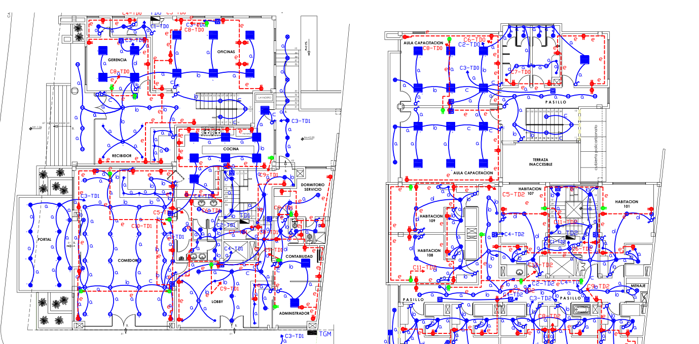{#fig-b2-planta width=100%}

En la @fig-b2-planta se observan recorridos de circuitos, puntos de iluminación, tomacorrientes, salidas especiales, identificación de circuitos y distribución por ambientes. Para leerla técnicamente se recomienda seguir este orden:

1. identificar el tablero o punto de alimentación principal;
2. reconocer los ambientes arquitectónicos;
3. ubicar luminarias y salidas de iluminación;
4. ubicar interruptores y su relación con los puntos de luz;
5. identificar tomacorrientes de uso general y tomacorrientes especiales;
6. seguir el recorrido de canalizaciones;
7. relacionar cada circuito con el cuadro de cargas.

## 2.1.3 Simbología eléctrica

La simbología eléctrica es el lenguaje gráfico del plano. Permite que el diseñador, el instalador, el fiscalizador y el personal de mantenimiento interpreten la misma información sin ambigüedad.

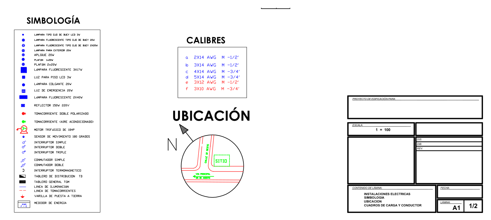{#fig-b2-simbologia width=100%}

En la @fig-b2-simbologia se integran símbolos eléctricos, referencias de ubicación y calibres. Esta información es indispensable para no confundir un punto de luz con un tomacorriente, una salida especial, una canalización o un elemento de protección.

## 2.1.4 Cuadro de cargas

El cuadro de cargas resume los circuitos que alimenta cada tablero. Permite evaluar la potencia instalada, seleccionar conductores, definir protecciones y verificar la distribución de cargas.

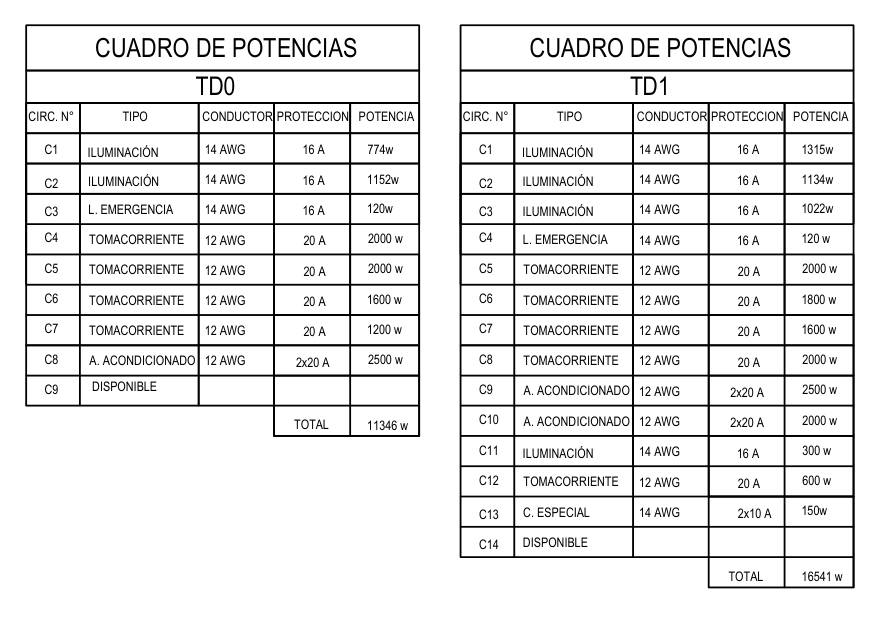{#fig-b2-cargas width=100%}

Un cuadro de cargas debe leerse verificando los siguientes datos:

| Dato | Interpretación técnica |
|---|---|
| Número de circuito | Identifica cada ramal o circuito derivado |
| Tipo de carga | Iluminación, tomacorriente, aire acondicionado, emergencia, reserva, etc. |
| Potencia | Carga instalada o estimada del circuito |
| Conductor | Calibre requerido para transportar la corriente |
| Protección | Capacidad nominal del interruptor termomagnético |
| Total | Potencia total asociada al tablero |

La corriente de diseño puede estimarse, para carga monofásica, mediante:

$$
I = \frac{P}{V\cos\varphi}
$$

Para cargas resistivas o cuando se asume factor de potencia unitario:

$$
I = \frac{P}{V}
$$

Donde:

- \(I\) es la corriente en amperios;
- \(P\) es la potencia en watts;
- \(V\) es el voltaje en voltios;
- \(\cos\varphi\) es el factor de potencia.

## 2.1.5 Diagrama unifilar

El diagrama unifilar representa la distribución eléctrica mediante una sola línea por circuito, aunque físicamente el circuito tenga varios conductores. Es útil para analizar alimentadores, tableros, interruptores principales, circuitos derivados y protecciones.

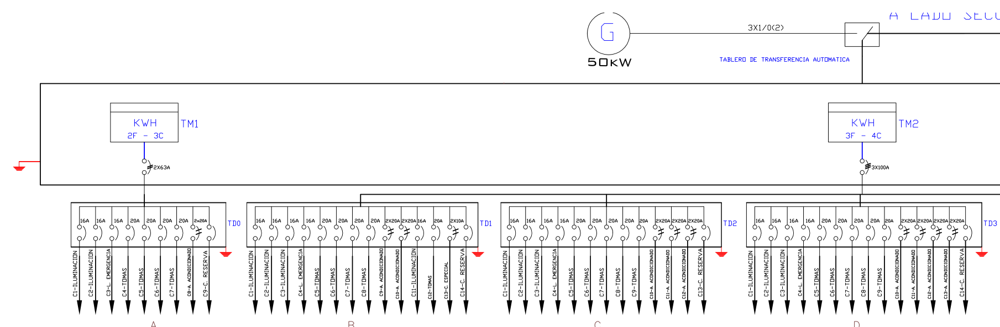{#fig-b2-unifilar width=100%}

En la @fig-b2-unifilar se observa la relación entre alimentación, medidores, tableros y circuitos derivados. Al revisar un unifilar debe identificarse:

- fuente de alimentación;
- tensión del sistema;
- tablero principal;
- tableros secundarios;
- protecciones principales y derivadas;
- circuitos de iluminación, tomacorrientes y cargas especiales;
- reservas o circuitos futuros.

---

# 2.2 Tipos de diagramas eléctricos

## 2.2.1 Concepto general

Un diagrama eléctrico es una representación gráfica que muestra cómo se conecta, alimenta, controla, protege o mide un sistema eléctrico. No todos los diagramas tienen el mismo nivel de detalle. Por ello, el lector debe identificar primero qué tipo de diagrama está observando.

| Tipo de diagrama | Qué representa | Uso principal |
|---|---|---|
| Plano en planta | Ubicación física de elementos | Diseño, montaje e inspección |
| Unifilar | Alimentación simplificada por circuitos | Análisis de tableros y protecciones |
| Multifilar | Conductores individuales | Cableado, diagnóstico y mantenimiento |
| Funcional | Secuencia lógica de operación | Comprender el funcionamiento |
| Potencia | Camino de energía hacia la carga | Motores, resistencias, bombas y cargas de fuerza |
| Control | Lógica de mando | Marcha, paro, enclavamientos, temporización y señalización |
| Instrumentación | Variables medidas y señales | Sensores, transmisores, indicadores y controladores |

## 2.2.2 Esquema funcional

El esquema funcional muestra la relación lógica entre dispositivos, sin necesariamente representar el recorrido físico exacto de los conductores.

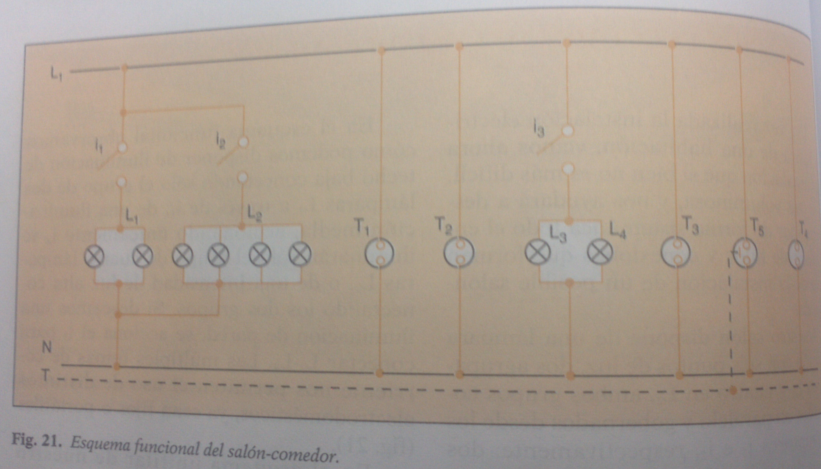{#fig-b2-funcional width=90%}

La @fig-b2-funcional permite relacionar interruptores, luminarias y tomacorrientes dentro de un mismo ambiente. Es útil para explicar cómo debe comportarse la instalación antes de entrar al detalle del cableado.

## 2.2.3 Esquema unifilar

El esquema unifilar simplifica la instalación usando una sola línea para representar uno o más conductores. En instalaciones residenciales permite observar circuitos, alimentación y protecciones.

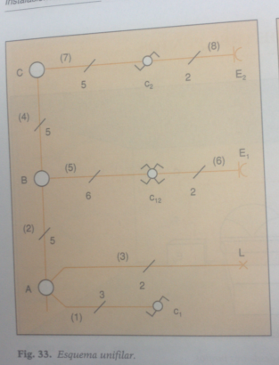{#fig-b2-ejemplo-unifilar width=55%}

## 2.2.4 Esquema multifilar

El esquema multifilar representa cada conductor por separado. Por tanto, es más detallado que el unifilar y se utiliza especialmente cuando se necesita comprender el cableado real.

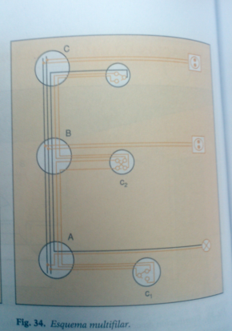{#fig-b2-ejemplo-multifilar width=60%}

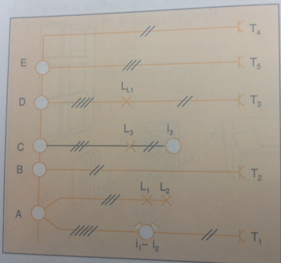{#fig-b2-multifilar-salon width=80%}

## 2.2.5 Diagrama de potencia y diagrama de control

En instalaciones industriales es común separar el circuito de potencia del circuito de control.

El **circuito de potencia** transporta la corriente principal hacia la carga. Alimenta motores, bombas, compresores, resistencias, hornos o equipos de fuerza. Sus elementos frecuentes son: interruptor termomagnético, fusibles, contactores de potencia, relé térmico, variador de frecuencia, motor y conductores de fuerza.

El **circuito de control** gobierna la operación de la carga. Maneja corrientes menores y permite ejecutar órdenes de marcha, paro, enclavamiento, temporización o señalización. Sus elementos frecuentes son: pulsadores, selectores, contactos auxiliares, bobinas, temporizadores, relés, sensores, lámparas piloto y PLC.

| Criterio | Circuito de potencia | Circuito de control |
|---|---|---|
| Función | Alimentar la carga principal | Gobernar la operación |
| Corriente | Mayor | Menor |
| Elementos | Breaker, contactor, relé térmico, motor | Pulsadores, contactos, bobinas, relés, PLC |
| Riesgo | Sobrecorriente, calentamiento, arco eléctrico | Maniobra incorrecta, error lógico |
| Documento | Diagrama de fuerza o potencia | Diagrama de mando o control |

---

# 2.3 Instalaciones básicas de alumbrado

Las instalaciones básicas de alumbrado permiten comprender de manera práctica cómo se controla una carga desde uno, dos o tres puntos. Estos circuitos son esenciales para viviendas, oficinas, pasillos, escaleras y áreas de circulación.

::: {.callout-tip}
Para interpretar estos circuitos conviene seguir siempre el recorrido de la fase: alimentación → protección → interruptor o conmutadores → retorno → lámpara → neutro.
:::

## 2.3.1 Encendido de un foco desde un punto

El encendido desde un punto utiliza un interruptor simple para controlar una luminaria. Es el circuito más básico y se aplica en ambientes donde se requiere un solo punto de mando.

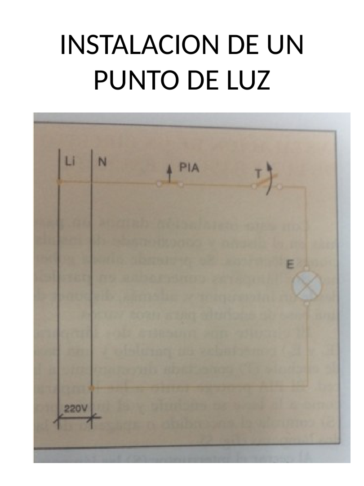{#fig-b2-slide-un-punto width=70%}

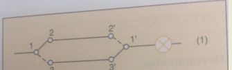{#fig-b2-un-punto width=55%}

### Funcionamiento

Cuando el interruptor está cerrado, existe continuidad entre la fase y el retorno hacia la lámpara; por tanto, el foco enciende. Cuando el interruptor abre el circuito, se interrumpe el paso de corriente y el foco se apaga.

La relación eléctrica básica es:

$$
I = \frac{P}{V}
$$

Por ejemplo, para un foco de \(60\,\mathrm{W}\) conectado a \(120\,\mathrm{V}\):

$$
I = \frac{60\,\mathrm{W}}{120\,\mathrm{V}}=0.5\,\mathrm{A}
$$

### Conductores mínimos del circuito

| Conductor | Función |
|---|---|
| Fase | Alimenta el interruptor |
| Retorno | Lleva la fase conmutada hacia la lámpara |
| Neutro | Completa el circuito en la lámpara |
| Tierra | Protección de partes metálicas, si aplica |

## 2.3.2 Encendido de un foco desde dos puntos

El encendido desde dos puntos permite controlar una misma luminaria desde dos ubicaciones. Se implementa con dos interruptores conmutados. Es muy utilizado en escaleras, pasillos, dormitorios con dos accesos y corredores.

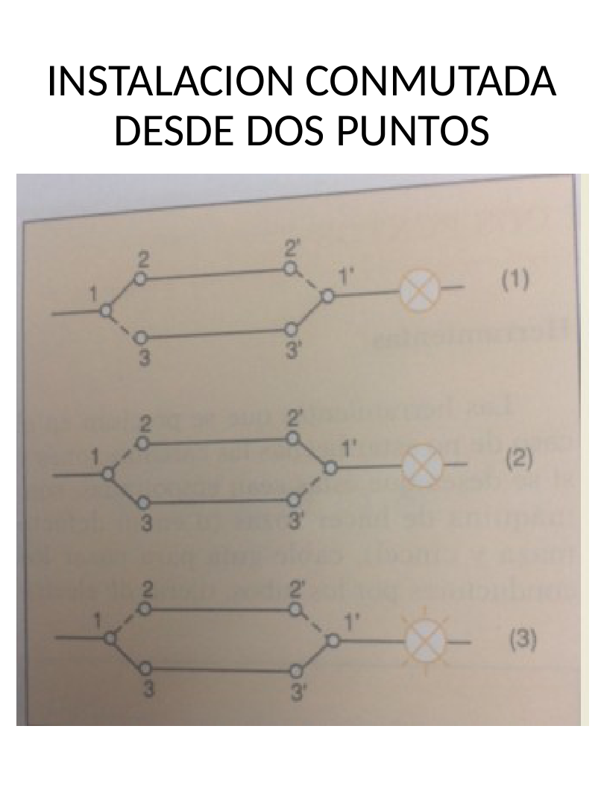{#fig-b2-slide-dos-puntos width=70%}

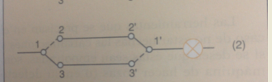{#fig-b2-dos-puntos width=55%}

### Funcionamiento

Los dos conmutadores cambian la continuidad entre dos conductores viajeros. Al accionar cualquiera de los dos dispositivos, se modifica el camino eléctrico y la lámpara cambia de estado.

| Elemento | Función |
|---|---|
| Conmutador 1 | Recibe la fase y selecciona uno de los viajeros |
| Viajeros | Conectan ambos conmutadores |
| Conmutador 2 | Recibe viajeros y entrega retorno a la lámpara |
| Lámpara | Carga controlada |
| Neutro | Retorno común hacia la fuente |

## 2.3.3 Encendido de un foco desde tres puntos

El encendido desde tres puntos se utiliza cuando se desea controlar una luminaria desde tres ubicaciones. Se emplean dos conmutadores extremos y un interruptor intermedio o de cruce.

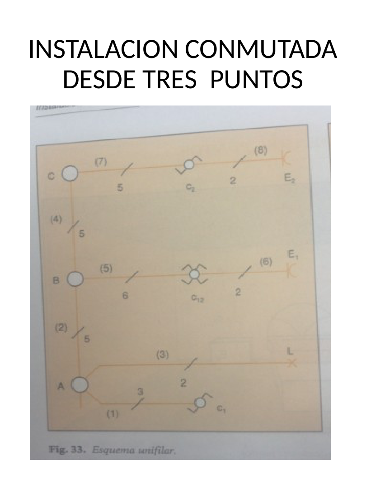{#fig-b2-slide-tres-puntos width=70%}

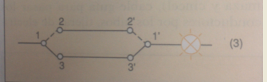{#fig-b2-tres-puntos width=55%}

### Funcionamiento

El interruptor intermedio invierte o cruza los conductores viajeros. Por ello, cualquiera de los tres puntos de mando puede cambiar el estado de la lámpara.

| Caso | Elementos de mando | Aplicación típica |
|---|---|---|
| Un punto | 1 interruptor simple | Habitación pequeña, baño, bodega |
| Dos puntos | 2 interruptores conmutados | Escalera, pasillo, dormitorio con dos accesos |
| Tres puntos | 2 conmutadores + 1 intermedio | Pasillo largo, escalera con descanso, área con tres accesos |

## 2.3.4 Ejemplos de instalación en ambiente real

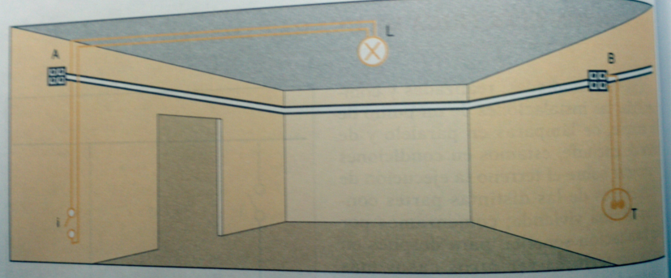{#fig-b2-distribucion-basica width=85%}

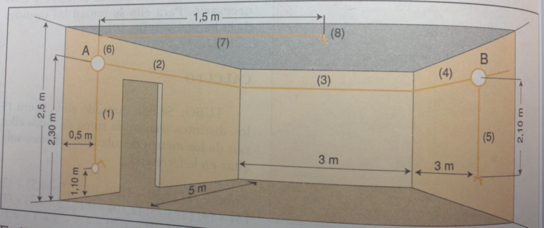{#fig-b2-habitacion-ref width=85%}

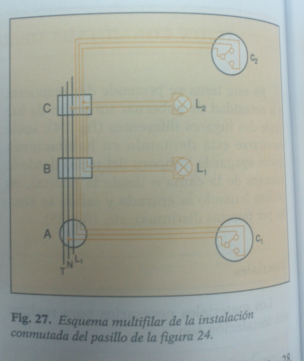{#fig-b2-pasillo-multifilar width=60%}

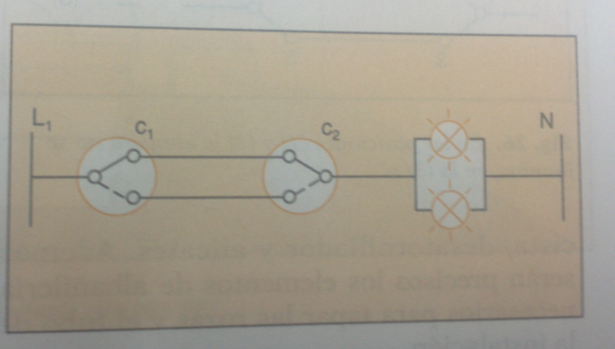{#fig-b2-doble-conmutada width=75%}

---

# 2.4 Interpretación técnica de planos eléctricos

## 2.4.1 Procedimiento de lectura

Para interpretar correctamente un plano eléctrico se recomienda seguir una secuencia ordenada:

1. revisar título, escala, lámina y alcance del plano;
2. leer la simbología y notas técnicas;
3. ubicar la alimentación general;
4. ubicar tablero principal y tableros secundarios;
5. identificar circuitos de iluminación;
6. identificar circuitos de tomacorrientes;
7. identificar cargas especiales;
8. relacionar circuitos con el cuadro de cargas;
9. revisar calibres y protecciones;
10. verificar puesta a tierra;
11. comparar el plano con el diagrama unifilar;
12. revisar si existen reservas o circuitos futuros.

## 2.4.2 Errores frecuentes en interpretación

| Error frecuente | Consecuencia | Acción correctiva |
|---|---|---|
| No leer la simbología | Confusión entre salidas | Revisar leyenda antes de interpretar |
| Confundir retorno con neutro | Falla de operación o riesgo eléctrico | Seguir el recorrido de fase y retorno |
| No revisar cuadro de cargas | Protección o conductor mal seleccionados | Verificar circuito, potencia y breaker |
| No relacionar planta y unifilar | Diagnóstico incompleto | Leer ambos documentos en conjunto |
| Ignorar puesta a tierra | Riesgo para personas y equipos | Confirmar conductor de protección |
| No verificar tensión nominal | Selección incorrecta de equipos | Revisar voltaje del sistema |

## 2.4.3 Relación entre plano y montaje

El plano indica lo que se debe instalar, pero el montaje exige verificar condiciones reales: ubicación de cajas, altura de interruptores, canalización disponible, accesibilidad del tablero, ruta de conductores y separación entre circuitos.

::: {.callout-warning}
Antes de intervenir un circuito se debe verificar ausencia de tensión con un instrumento adecuado y aplicar procedimientos seguros de trabajo.
:::

---

# 2.5 Introducción a las mediciones eléctricas

## 2.5.1 Importancia de medir

La medición eléctrica permite comprobar si una instalación corresponde al plano, si los circuitos están correctamente alimentados y si las cargas funcionan dentro de los valores esperados.

Una medición técnica requiere:

- seleccionar el instrumento correcto;
- elegir la escala adecuada;
- conectar el instrumento correctamente;
- registrar valor y unidad;
- interpretar el resultado;
- estimar el error asociado;
- trabajar bajo condiciones seguras.

## 2.5.2 Magnitudes e instrumentos

| Magnitud | Símbolo | Unidad | Instrumento | Conexión básica |
|---|---|---|---|---|
| Voltaje | \(V\) | voltio \(V\) | Voltímetro o multímetro | Paralelo |
| Corriente | \(I\) | amperio \(A\) | Amperímetro o pinza amperimétrica | Serie o abrazando conductor |
| Resistencia | \(R\) | ohmio \(\Omega\) | Óhmetro o multímetro | Circuito desenergizado |
| Potencia | \(P\) | watt \(W\) | Vatímetro o cálculo | Según método |
| Energía | \(E\) | kilowatt-hora \(kWh\) | Medidor de energía | En acometida o tablero |

## 2.5.3 Medición de voltaje

El voltaje se mide en paralelo con el elemento o puntos entre los que se desea conocer la diferencia de potencial.

$$
V = V_{ab}
$$

Ejemplos típicos:

- voltaje fase-neutro;
- voltaje fase-fase;
- voltaje en bornes de una carga;
- voltaje en salida de tomacorriente.

## 2.5.4 Medición de corriente

La corriente se mide en serie con la carga o mediante pinza amperimétrica alrededor de un conductor individual.

$$
I = I_{\text{carga}}
$$

No debe abrazarse fase y neutro al mismo tiempo con una pinza amperimétrica para medir corriente de carga, porque los campos se cancelan y la lectura puede ser incorrecta.

## 2.5.5 Medición de resistencia y continuidad

La resistencia se mide únicamente con el circuito desenergizado. La continuidad permite verificar si existe camino eléctrico entre dos puntos.

$$
R = \frac{V}{I}
$$

::: {.callout-important}
Nunca se debe medir resistencia en un circuito energizado. Esta práctica puede dañar el instrumento y poner en riesgo al operador.
:::

---

# 2.6 Fórmulas eléctricas aplicadas al bloque

Las siguientes expresiones se escriben en LaTeX para que Quarto las renderice correctamente en HTML. Se recomienda conservarlas entre delimitadores `$$ ... $$` cuando se edite el archivo.

## 2.6.1 Ley de Ohm

$$
V = I R
$$

$$
I = \frac{V}{R}
$$

$$
R = \frac{V}{I}
$$

## 2.6.2 Potencia monofásica

Para cargas resistivas o factor de potencia unitario:

$$
P = V I
$$

Para corriente alterna con factor de potencia:

$$
P = V I \cos\varphi
$$

Por tanto:

$$
I = \frac{P}{V\cos\varphi}
$$

## 2.6.3 Potencia trifásica

$$
P = \sqrt{3}\,V_L I_L \cos\varphi
$$

Donde:

- \(V_L\) es el voltaje de línea;
- \(I_L\) es la corriente de línea;
- \(\cos\varphi\) es el factor de potencia.

## 2.6.4 Energía eléctrica

$$
E = P t
$$

Si la potencia se expresa en kilowatts y el tiempo en horas:

$$
E\,(\mathrm{kWh})=P\,(\mathrm{kW})\,t\,(\mathrm{h})
$$

---

# 2.7 Exactitud, precisión y error de medición

## 2.7.1 Exactitud

La exactitud indica qué tan cerca está una medición del valor verdadero o de referencia.

## 2.7.2 Precisión

La precisión indica qué tan repetibles son varias mediciones bajo condiciones similares.

## 2.7.3 Error absoluto

$$
E_a = |X_m - X_r|
$$

Donde:

- \(E_a\) es el error absoluto;
- \(X_m\) es el valor medido;
- \(X_r\) es el valor de referencia.

## 2.7.4 Error relativo

$$
E_r = \frac{E_a}{X_r}
$$

## 2.7.5 Error porcentual

$$
E_{\%}=\left(\frac{E_a}{X_r}\right)\times 100\,\%
$$

## 2.7.6 Ejemplo resuelto

Un tomacorriente debería entregar \(120\,\mathrm{V}\), pero el multímetro registra \(118\,\mathrm{V}\).

Error absoluto:

$$
E_a = |118-120|=2\,\mathrm{V}
$$

Error relativo:

$$
E_r = \frac{2}{120}=0.0167
$$

Error porcentual:

$$
E_{\%}=0.0167\times100\,\%=1.67\,\%
$$

Interpretación: la medición presenta una diferencia del \(1.67\,\%\) respecto al valor de referencia.

---

# 2.8 Procedimiento de medición segura

## 2.8.1 Antes de medir

- Revisar el estado físico del instrumento.
- Verificar puntas de prueba y aislamiento.
- Seleccionar magnitud y escala adecuada.
- Confirmar si el circuito debe estar energizado o desenergizado.
- Identificar fase, neutro y tierra.
- Utilizar equipo de protección personal cuando aplique.

## 2.8.2 Durante la medición

- Mantener las manos alejadas de partes energizadas.
- No cambiar de escala con las puntas conectadas si el instrumento no lo permite.
- Conectar el voltímetro en paralelo.
- Conectar el amperímetro en serie, salvo uso de pinza amperimétrica.
- No medir resistencia con tensión presente.

## 2.8.3 Después de medir

- Registrar valor, unidad, fecha y condición de prueba.
- Comparar contra valor esperado.
- Analizar posibles fuentes de error.
- Desenergizar si se va a modificar el circuito.
- Guardar el instrumento correctamente.

---

# 2.9 Actividad integradora del bloque

## 2.9.1 Caso de estudio

A partir de los archivos adjuntos del bloque, el estudiante debe interpretar una instalación eléctrica básica y elaborar un informe técnico breve.

## 2.9.2 Actividades

1. Identificar en la planta los circuitos de iluminación, tomacorrientes y cargas especiales.
2. Relacionar los símbolos del plano con la tabla de simbología.
3. Interpretar el cuadro de cargas y explicar el significado de conductor, protección y potencia.
4. Explicar la estructura del diagrama unifilar.
5. Dibujar a mano o en software un encendido de foco desde un punto.
6. Dibujar un control de foco desde dos puntos.
7. Dibujar un control de foco desde tres puntos.
8. Medir voltaje en un tomacorriente bajo supervisión.
9. Calcular el error porcentual si se compara con un valor de referencia.
10. Entregar conclusiones técnicas.

## 2.9.3 Tabla de registro de mediciones

| Punto medido | Valor esperado | Valor medido | Error absoluto | Error porcentual | Observación |
|---|---:|---:|---:|---:|---|
| Tomacorriente 1 fase-neutro | 120 V |  |  |  |  |
| Tomacorriente 2 fase-neutro | 120 V |  |  |  |  |
| Salida de iluminación | 120 V |  |  |  |  |
| Continuidad de conductor | 0 \(\Omega\) aprox. |  |  |  | Circuito desenergizado |

## 2.9.4 Entregables mínimos

| Entregable | Contenido esperado |
|---|---|
| Interpretación de planta | Identificación de ambientes, circuitos y dispositivos |
| Análisis de simbología | Tabla con símbolos principales y significado |
| Lectura del cuadro de cargas | Explicación de potencia, conductor y protección |
| Interpretación del unifilar | Alimentación, tableros y circuitos derivados |
| Esquemas básicos | Un punto, dos puntos y tres puntos |
| Registro de mediciones | Valores medidos, unidades y error porcentual |

---

# Preguntas de repaso

1. ¿Qué información aporta una planta eléctrica?
2. ¿Por qué debe revisarse la simbología antes de interpretar el plano?
3. ¿Qué información contiene un cuadro de cargas?
4. ¿Qué representa un diagrama unifilar?
5. ¿Cuál es la diferencia entre unifilar y multifilar?
6. ¿Qué es un esquema funcional?
7. ¿Qué elementos forman un encendido desde un punto?
8. ¿Qué elementos se requieren para controlar un foco desde dos puntos?
9. ¿Qué elemento adicional se requiere para controlar un foco desde tres puntos?
10. ¿Qué diferencia existe entre circuito de potencia y circuito de control?
11. ¿Cómo se conecta un voltímetro?
12. ¿Cómo se conecta un amperímetro?
13. ¿Por qué no se mide resistencia en un circuito energizado?
14. ¿Qué es exactitud?
15. ¿Qué es precisión?
16. ¿Cómo se calcula el error porcentual?

---

# Cierre del bloque

El Bloque 2 integra la lectura de planos, la interpretación de diagramas eléctricos y la medición de magnitudes eléctricas. La relación entre planta, simbología, cuadro de cargas y diagrama unifilar permite comprender una instalación como sistema técnico. Los esquemas de encendido desde uno, dos y tres puntos fortalecen la comprensión práctica del alumbrado residencial, mientras que la instrumentación permite verificar el funcionamiento real de los circuitos.
