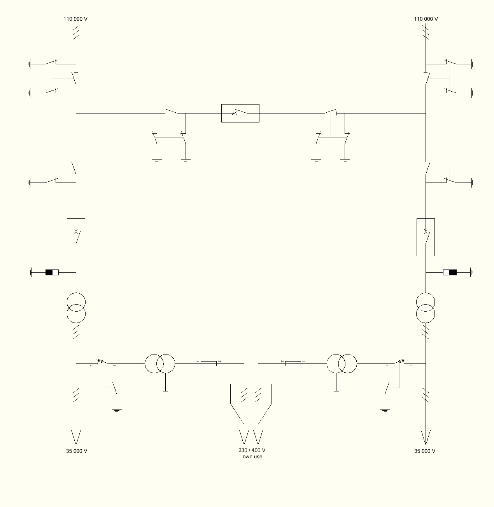
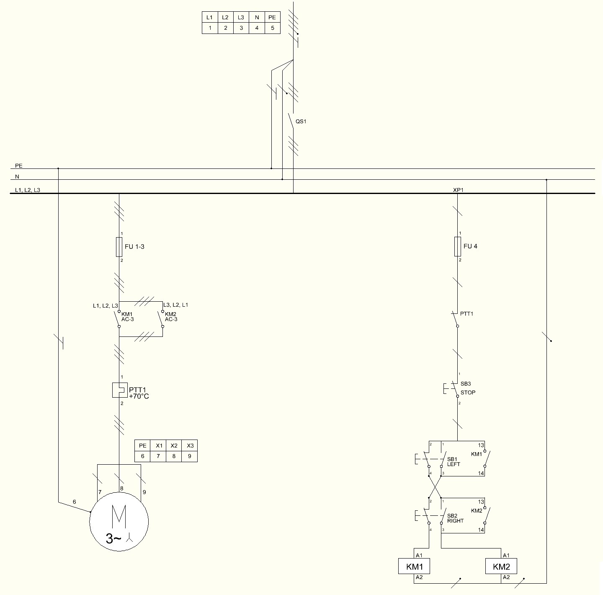
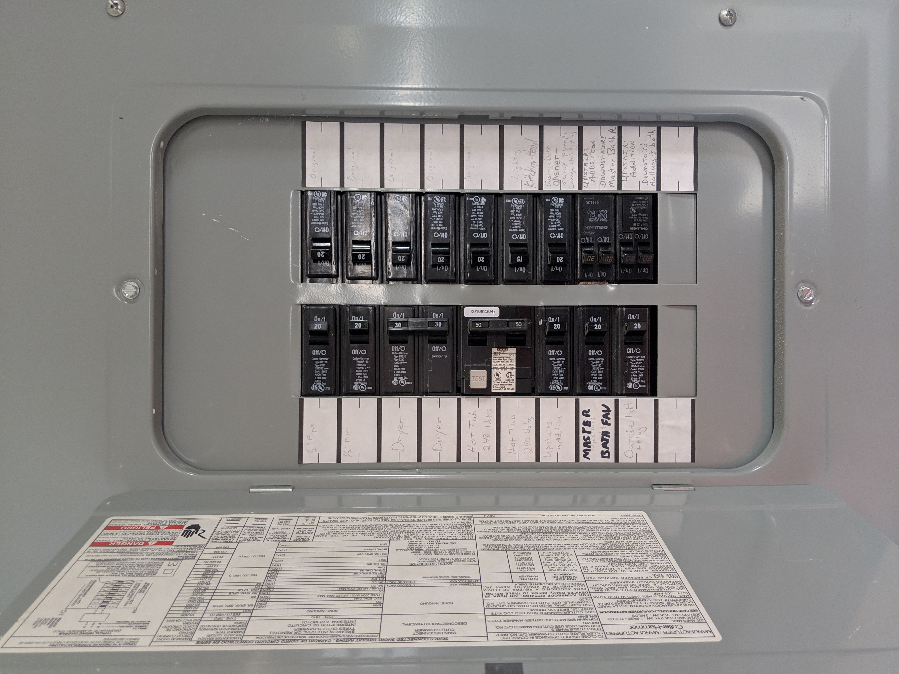
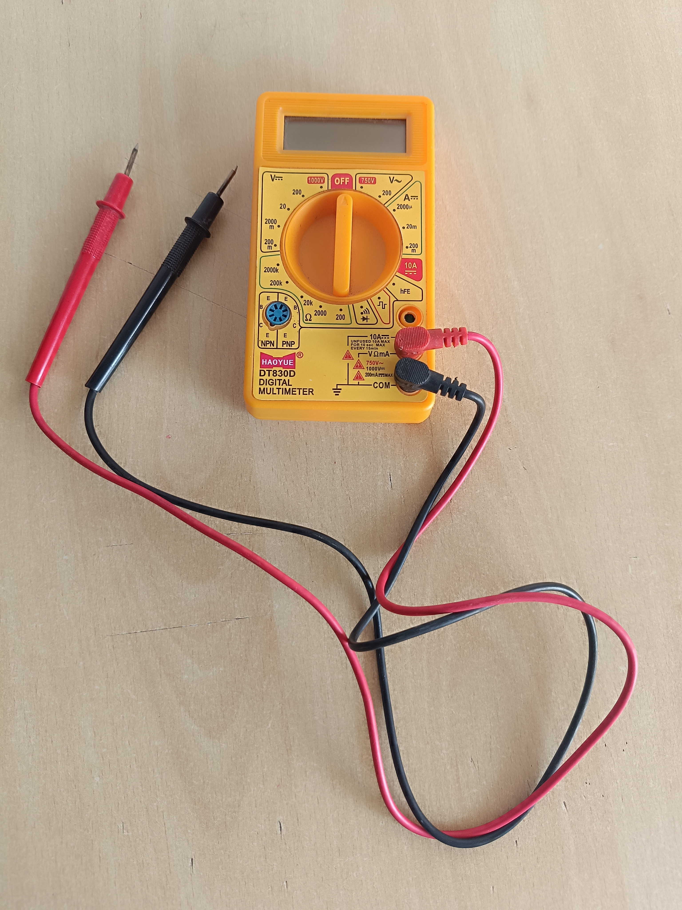
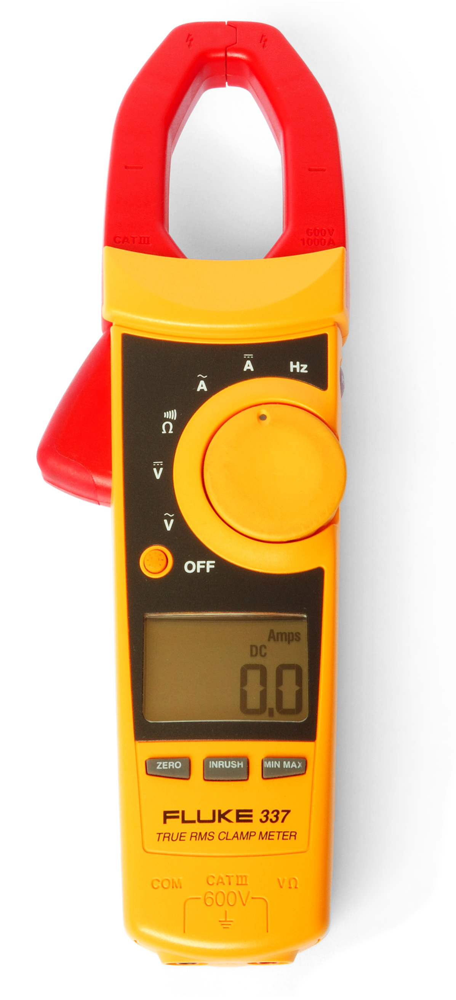
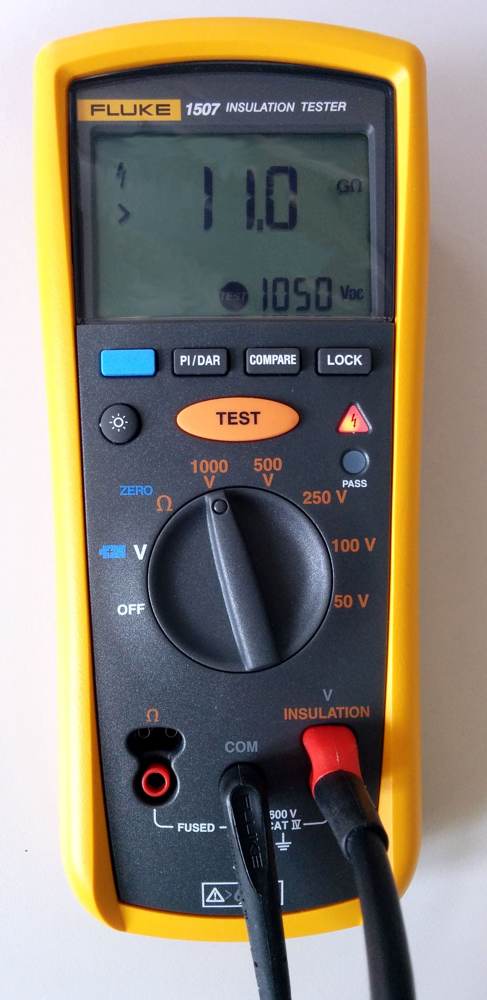
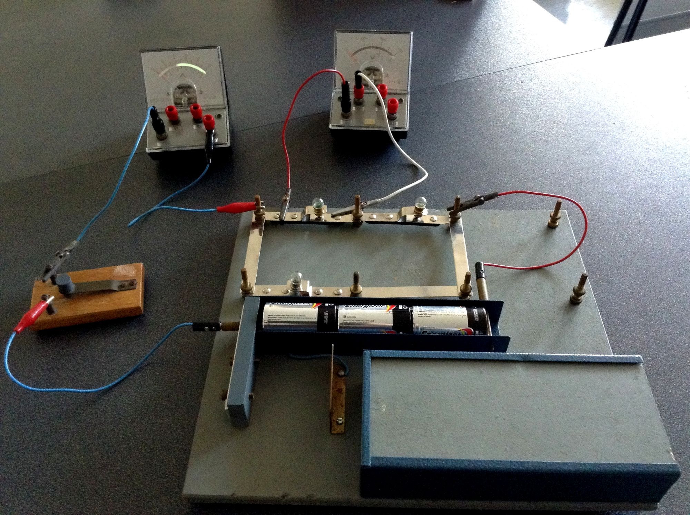

# Bloque 2: Diagramas Eléctricos e Instrumentación

## Presentación del bloque

El Bloque 2 profundiza en la interpretación y elaboración de diagramas eléctricos, así como en el uso técnico de instrumentos de medición. Este bloque conecta los fundamentos normativos y de simbología estudiados en el Bloque 1 con la representación funcional de instalaciones civiles e industriales.

En una instalación eléctrica real, el plano o diagrama no es únicamente un dibujo. Es un documento técnico que permite diseñar, construir, operar, diagnosticar, mantener y modificar un sistema eléctrico. Por esta razón, el estudiante debe diferenciar entre plano en planta, diagrama unifilar, diagrama multifilar, diagrama de potencia, diagrama de control e información de instrumentación.

Además, este bloque introduce la medición eléctrica como proceso técnico. Medir no consiste solamente en observar un número en la pantalla de un instrumento; implica seleccionar el equipo adecuado, conectar correctamente, registrar la unidad, interpretar el dato y reconocer el posible error de medición.

::: {.callout-note}
El propósito central del bloque es que el estudiante pase de “ver símbolos” a “leer sistemas eléctricos”, interpretando cómo se alimentan, protegen, controlan y verifican las instalaciones civiles e industriales.
:::

---

## Resultado de aprendizaje del bloque

Al finalizar este bloque, el estudiante interpreta diagramas y planos eléctricos, realiza mediciones de magnitudes eléctricas utilizando instrumentos adecuados y analiza la exactitud, precisión y errores de medición para la correcta evaluación de sistemas eléctricos.

---

## Objetivo específico del bloque

Analizar e interpretar diagramas eléctricos de instalaciones civiles e industriales, aplicando adecuadamente técnicas de medición eléctrica y el uso de instrumentos, para evaluar con criterio técnico la exactitud, precisión y los errores en los resultados obtenidos.

---

# 2.1 Tipos de diagramas eléctricos

## Concepto de diagrama eléctrico

Un diagrama eléctrico es una representación gráfica de un circuito, instalación o sistema eléctrico. Su función es mostrar cómo se alimenta, conecta, protege, controla y opera un conjunto de elementos eléctricos.

Un diagrama eléctrico puede representar una instalación completa o solo una parte de ella. Por ejemplo, puede mostrar la distribución desde un tablero general, el arranque de un motor, la conexión de un instrumento, el mando de un contactor o el esquema de protección de un alimentador.

## Tabla 2.1. Tipos de diagramas eléctricos

| Tipo de diagrama | Qué representa | Uso principal |
|---|---|---|
| Plano eléctrico en planta | Ubicación física de dispositivos sobre el plano arquitectónico | Diseño, montaje e inspección |
| Diagrama unifilar | Distribución eléctrica simplificada mediante una línea por circuito | Análisis de alimentación, protecciones y tableros |
| Diagrama multifilar | Conexión individual de conductores | Cableado, verificación y mantenimiento |
| Diagrama de potencia | Camino de la energía hacia la carga | Alimentación de motores y cargas industriales |
| Diagrama de control | Lógica de mando y operación | Marcha, paro, enclavamientos, señalización |
| Diagrama de instrumentación | Señales de medición y control | Sensores, transmisores, indicadores y controladores |
| Esquema de tablero | Disposición de elementos dentro de gabinete | Fabricación, montaje y mantenimiento de tableros |

## Relación entre diagramas

En un proyecto real, los diagramas se complementan. El plano en planta indica dónde se ubican los elementos; el diagrama unifilar muestra cómo se alimentan; el multifilar permite ver los conductores; el diagrama de potencia muestra el flujo de energía hacia la carga; y el diagrama de control explica la lógica de mando.

::: {.callout-important}
Un error frecuente es pensar que todos los diagramas cumplen la misma función. En realidad, cada diagrama responde a una pregunta técnica distinta.
:::

---

# 2.2 Diagramas unifilares y multifilares

## Diagrama unifilar

El diagrama unifilar representa un sistema eléctrico mediante una sola línea por circuito, aunque físicamente existan varios conductores. Es muy utilizado en tableros, acometidas, alimentadores, subestaciones, centros de carga y sistemas de distribución.

Este tipo de diagrama permite revisar:

- fuente de alimentación;
- transformador o acometida;
- interruptor principal;
- barras principales;
- alimentadores;
- tableros secundarios;
- protecciones;
- cargas principales;
- sistema de puesta a tierra;
- niveles de tensión;
- corriente nominal;
- capacidad interruptiva.

{#fig-b2-unifilar-subestacion width=75%}

**Fuente:** Wikimedia Commons, archivo *110kV substation wiring.JPG*. Autor: Dmitry G. Licencia: CC BY-SA 3.0 / GFDL.

La @fig-b2-unifilar-subestacion muestra un ejemplo de diagrama unifilar. Aunque corresponde a una subestación de distribución, permite observar el principio de representación simplificada: una sola línea resume la estructura principal del sistema.

## Diagrama multifilar

El diagrama multifilar representa cada conductor de forma independiente. A diferencia del unifilar, no simplifica el circuito en una sola línea, sino que muestra la conexión real de conductores, fases, neutro, tierra, contactos, bobinas, cargas, borneras y protecciones.

El multifilar es útil para:

- montaje de tableros;
- cableado de equipos;
- revisión de continuidad;
- diagnóstico de fallas;
- identificación de conductores;
- verificación de terminales;
- mantenimiento correctivo.

## Tabla 2.2. Comparación entre diagrama unifilar y multifilar

| Criterio | Diagrama unifilar | Diagrama multifilar |
|---|---|---|
| Nivel de detalle | General | Detallado |
| Representación | Una línea por circuito | Cada conductor se representa por separado |
| Uso principal | Distribución y protecciones | Cableado y verificación |
| Ventaja | Simplifica sistemas grandes | Muestra conexiones reales |
| Limitación | No muestra todos los conductores | Puede ser extenso y complejo |
| Aplicación típica | Acometidas, alimentadores, tableros | Motores, tableros de control, borneras |

## Ejemplo de interpretación

Si en un diagrama unifilar aparece un motor trifásico, se puede conocer su alimentador y protección. Sin embargo, para conocer cómo se conectan L1, L2, L3, PE, contactor, relé térmico y bornera, se requiere un diagrama multifilar o un diagrama de potencia detallado.

---

# 2.3 Diagramas de control y potencia

## Circuito de potencia

El circuito de potencia, también denominado circuito de fuerza, es el camino por donde circula la corriente principal hacia la carga. En instalaciones industriales alimenta motores, bombas, compresores, ventiladores, resistencias, hornos o máquinas.

Elementos frecuentes:

- interruptor termomagnético;
- fusible;
- guardamotor;
- contactor de potencia;
- relé térmico;
- variador de frecuencia;
- motor;
- conductores de fuerza;
- borneras de potencia.

## Circuito de control

El circuito de control, también llamado circuito de mando, define la lógica de operación. Trabaja con corrientes menores y permite ordenar la marcha, paro, enclavamiento, temporización, señalización o protección lógica de una carga.

Elementos frecuentes:

- pulsador de marcha;
- pulsador de paro;
- paro de emergencia;
- contacto auxiliar;
- bobina de contactor;
- temporizador;
- relé;
- lámpara piloto;
- sensor;
- final de carrera;
- PLC.

{#fig-b2-control-motor width=85%}

**Fuente:** Wikimedia Commons, archivo *AC motor reverse without auxilary contacts.jpg*. Autor: Dmitry G. Licencia: CC BY-SA 3.0 / GFDL.

La @fig-b2-control-motor presenta un circuito de inversión de giro con contactores. Este tipo de diagrama permite diferenciar visualmente la parte de potencia y la parte de mando, así como los elementos de protección y maniobra.

## Tabla 2.3. Diferencias entre potencia y control

| Criterio | Circuito de potencia | Circuito de control |
|---|---|---|
| Función | Alimentar la carga principal | Gobernar la operación |
| Corriente | Alta o media | Baja |
| Elementos principales | Breaker, contactor, relé térmico, motor | Pulsadores, contactos, bobinas, relés, PLC |
| Riesgo principal | Sobrecorriente, arco eléctrico, calentamiento | Maniobra no deseada, error lógico |
| Documento asociado | Diagrama de potencia | Diagrama de mando |
| Verificación | Continuidad de fuerza y protecciones | Secuencia lógica y señales |

## Ejemplo: arranque directo de motor

Un arranque directo de motor puede representarse con dos diagramas:

1. **Diagrama de potencia:** alimentación trifásica, breaker, contactor, relé térmico y motor.
2. **Diagrama de control:** pulsador de paro, pulsador de marcha, contacto auxiliar de enclavamiento, contacto del relé térmico y bobina del contactor.

Cuando el operador presiona marcha, se energiza la bobina del contactor. Al cerrarse los contactos principales, la energía llega al motor. Si se produce sobrecarga, el relé térmico abre el circuito de control y detiene el sistema.

---

# 2.4 Interpretación de planos eléctricos

## Lectura técnica de planos

Interpretar un plano eléctrico significa comprender la relación entre símbolos, conexiones, circuitos, cargas, protecciones y ubicación física de los elementos. Esta habilidad es indispensable para montaje, mantenimiento y diagnóstico.

{#fig-b2-panel-abierto width=80%}

**Fuente:** Wikimedia Commons, archivo *Electrical panel opened.jpg*. Autor: FuriousYogi. Licencia: CC BY-SA 4.0.

La @fig-b2-panel-abierto muestra un tablero con interruptores automáticos identificados. Esta imagen permite relacionar el plano eléctrico con la instalación física: cada circuito debe estar protegido, identificado y documentado.

## Procedimiento recomendado para interpretar un plano

1. Revisar el título del plano y el alcance del documento.
2. Revisar simbología y abreviaturas.
3. Identificar la fuente de alimentación.
4. Ubicar tablero principal y tableros secundarios.
5. Localizar cargas principales.
6. Diferenciar potencia y control.
7. Verificar protecciones.
8. Revisar numeración de cables y borneras.
9. Comparar con el cuadro de cargas.
10. Revisar notas técnicas.
11. Verificar puesta a tierra.
12. Confirmar rotulado y correspondencia con la instalación real.

## Tabla 2.4. Errores frecuentes al interpretar planos

| Error frecuente | Consecuencia | Recomendación |
|---|---|---|
| No revisar la leyenda | Confusión de símbolos | Leer la simbología antes de interpretar |
| Confundir potencia y control | Diagnóstico incorrecto | Separar ambos circuitos |
| Ignorar numeración de cables | Error de conexión | Verificar borneras y marcas |
| No comparar con cuadro de cargas | Protección mal seleccionada | Revisar potencia, corriente y breaker |
| No leer notas técnicas | Omisión de restricciones | Revisar observaciones del plano |
| No verificar puesta a tierra | Riesgo de seguridad | Confirmar PE y barras de tierra |

---

# 2.5 Introducción a las mediciones eléctricas

## Importancia de medir

Medir es comparar una magnitud con una unidad de referencia. En instalaciones eléctricas, las mediciones permiten verificar si un sistema opera dentro de condiciones seguras y funcionales.

Las mediciones eléctricas permiten:

- comprobar presencia o ausencia de tensión;
- verificar continuidad;
- medir corriente de carga;
- detectar sobrecargas;
- comprobar caída de tensión;
- revisar resistencia de aislamiento;
- medir potencia;
- estimar factor de potencia;
- diagnosticar fallas;
- validar instalaciones después del montaje.

## Instrumentos de medición

:::: {.columns}

::: {.column width="33%"}
{#fig-b2-multimetro width=100%}

**Fuente:** Wikimedia Commons, archivo *Digital Multimeter (To measure Voltage, Current and Resistance).jpg*. Autor: K.Venkataramana. Licencia: CC0.
:::

::: {.column width="33%"}
{#fig-b2-pinza width=100%}

**Fuente:** Wikimedia Commons, archivo *Clampmeter Fluke 337.jpg*. Autor: Harke. Dominio público.
:::

::: {.column width="33%"}
{#fig-b2-megohmetro width=100%}

**Fuente:** Wikimedia Commons, archivo *Isolationsmessgerät 1507.jpg*. Autor: wdwd. Licencia: CC BY-SA 4.0.
:::

::::

Las @fig-b2-multimetro, @fig-b2-pinza y @fig-b2-megohmetro muestran instrumentos de uso frecuente en laboratorio y obra. El multímetro sirve para mediciones generales; la pinza amperimétrica permite medir corriente sin abrir el circuito; y el medidor de aislamiento permite evaluar el estado dieléctrico de cables, motores y equipos.

## Tabla 2.5. Instrumentos y magnitudes

| Instrumento | Magnitud principal | Aplicación |
|---|---|---|
| Voltímetro | Tensión | Verificar alimentación y caída de tensión |
| Amperímetro | Corriente | Medir corriente de carga |
| Pinza amperimétrica | Corriente | Medición sin abrir el circuito |
| Óhmetro | Resistencia | Verificar resistencias y continuidad |
| Multímetro | Varias magnitudes | Medición general en laboratorio y campo |
| Megóhmetro | Resistencia de aislamiento | Evaluación de cables, motores y tableros |
| Vatímetro | Potencia activa | Evaluación de consumo |
| Analizador de redes | V, I, P, Q, S, FP, armónicos | Diagnóstico avanzado |

::: {.callout-warning}
Antes de realizar una medición se debe confirmar si el circuito debe estar energizado o desenergizado. Resistencia, continuidad y aislamiento se miden con el circuito sin tensión.
:::

---

# 2.6 Magnitudes eléctricas fundamentales e instrumentos de medición

## Magnitudes principales

Las magnitudes eléctricas básicas permiten describir el comportamiento de una instalación. En este bloque se analizan desde el punto de vista de la medición.

## Tabla 2.6. Magnitudes eléctricas fundamentales

| Magnitud | Símbolo | Unidad | Instrumento | Forma de conexión |
|---|---|---|---|---|
| Voltaje | \(V\) | Voltio (V) | Voltímetro / multímetro | Paralelo |
| Corriente | \(I\) | Amperio (A) | Amperímetro / pinza | Serie o pinza |
| Resistencia | \(R\) | Ohmio (\(\Omega\)) | Óhmetro | Circuito desenergizado |
| Potencia activa | \(P\) | Watt (W) | Vatímetro / analizador | Según instrumento |
| Energía | \(E\) | kWh | Medidor de energía | Instalado en red |
| Frecuencia | \(f\) | Hertz (Hz) | Frecuencímetro | Paralelo |
| Factor de potencia | FP | Adimensional | Analizador de redes | Según instrumento |
| Resistencia de aislamiento | \(R_{iso}\) | M\(\Omega\) | Megóhmetro | Circuito desenergizado |

## Conexión de instrumentos

{#fig-b2-voltimetro-amperimetro width=85%}

**Fuente:** Wikimedia Commons, archivo *Electric circuit with voltmeter and ammeter.JPG*. Autor: Meganbeckett27. Licencia: CC BY-SA 3.0.

La @fig-b2-voltimetro-amperimetro muestra una práctica de laboratorio con voltímetro y amperímetro. En términos generales, el voltímetro se conecta en paralelo con el elemento de interés, mientras que el amperímetro se conecta en serie con la corriente que se desea medir.

## Fórmulas útiles en instalaciones y mediciones

En Quarto, las expresiones matemáticas se escriben con sintaxis LaTeX. Para una lectura clara en HTML se utilizarán ecuaciones centradas. Las variables principales son: voltaje `\(V\)`, corriente `\(I\)`, resistencia `\(R\)`, potencia activa `\(P\)`, potencia aparente `\(S\)`, potencia reactiva `\(Q\)` y factor de potencia `\(\cos\phi\)`.

### Ley de Ohm

La Ley de Ohm relaciona voltaje, corriente y resistencia:

$$
V = I \, R
$$

De esta expresión se despejan:

$$
I = \frac{V}{R}
$$

$$
R = \frac{V}{I}
$$

Donde:

- \(V\) es el voltaje, medido en voltios \(\mathrm{V}\).
- \(I\) es la corriente, medida en amperios \(\mathrm{A}\).
- \(R\) es la resistencia, medida en ohmios \(\Omega\).

### Potencia eléctrica en corriente alterna monofásica

Para una carga monofásica, la potencia activa se expresa como:

$$
P = V \, I \, \cos\phi
$$

Por tanto, la corriente de diseño puede estimarse mediante:

$$
I = \frac{P}{V \, \cos\phi}
$$

La potencia aparente monofásica se calcula como:

$$
S = V \, I
$$

Y la relación entre potencia activa, aparente y factor de potencia es:

$$
\cos\phi = \frac{P}{S}
$$

### Potencia eléctrica en corriente alterna trifásica

En un sistema trifásico balanceado, la potencia activa se calcula como:

$$
P = \sqrt{3} \, V_L \, I_L \, \cos\phi
$$

La potencia aparente trifásica se obtiene con:

$$
S = \sqrt{3} \, V_L \, I_L
$$

De la ecuación de potencia activa trifásica se puede despejar la corriente de línea:

$$
I_L = \frac{P}{\sqrt{3} \, V_L \, \cos\phi}
$$

Donde:

- \(V_L\) es el voltaje de línea.
- \(I_L\) es la corriente de línea.
- \(\cos\phi\) es el factor de potencia.

{#fig-b2-factor-potencia width=80%}

**Fuente:** Wikimedia Commons, archivo *Electric power factor.svg*. Autor: VoidZero / F l a n k e r. Licencia: GFDL, CC BY-SA 3.0 y Free Art License.

La @fig-b2-factor-potencia representa el triángulo de potencia. En cargas industriales inductivas, la potencia activa \(P\), la potencia reactiva \(Q\) y la potencia aparente \(S\) permiten analizar el factor de potencia del sistema.

## Ejemplo aplicado

Un motor trifásico opera con los siguientes datos:

$$
V_L = 220 \, \mathrm{V}
$$

$$
I_L = 12 \, \mathrm{A}
$$

$$
\cos\phi = 0.85
$$

La potencia activa aproximada se calcula con:

$$
P = \sqrt{3} \, V_L \, I_L \, \cos\phi
$$

Sustituyendo valores:

$$
P = \sqrt{3} \, (220) \, (12) \, (0.85)
$$

$$
P = 3886.7 \, \mathrm{W}
$$

$$
P \approx 3.89 \, \mathrm{kW}
$$

También se puede calcular la potencia aparente trifásica:

$$
S = \sqrt{3} \, V_L \, I_L
$$

$$
S = \sqrt{3} \, (220) \, (12) = 4572.4 \, \mathrm{VA}
$$

$$
S \approx 4.57 \, \mathrm{kVA}
$$

La relación entre ambas magnitudes confirma el factor de potencia:

$$
\cos\phi = \frac{P}{S} = \frac{3.89}{4.57} \approx 0.85
$$

Esta información permite estimar demanda, seleccionar protecciones y analizar el comportamiento de la carga.

---

# 2.7 Procedimientos de medición

## Procedimiento general

Un procedimiento de medición debe ser ordenado, repetible y seguro. No basta con colocar las puntas del instrumento; el estudiante debe justificar qué mide, cómo lo mide y qué significa el resultado.

## Tabla 2.7. Procedimiento general de medición

| Paso | Acción | Criterio técnico |
|---|---|---|
| 1 | Identificar magnitud | Voltaje, corriente, resistencia, potencia, etc. |
| 2 | Seleccionar instrumento | Debe corresponder a la magnitud |
| 3 | Revisar estado del instrumento | Puntas, batería, fusible, carcasa |
| 4 | Seleccionar escala | Rango superior al valor esperado |
| 5 | Definir conexión | Serie, paralelo, pinza o circuito abierto |
| 6 | Verificar seguridad | Energizado o desenergizado según medición |
| 7 | Realizar medición | Evitar contacto con partes energizadas |
| 8 | Registrar lectura | Valor, unidad, escala y condición |
| 9 | Repetir si es necesario | Permite evaluar dispersión |
| 10 | Interpretar resultado | Comparar con valor esperado o nominal |

## Medición de voltaje

El voltaje se mide en paralelo. En instalaciones de baja tensión se puede medir entre:

- fase y neutro;
- fase y fase;
- fase y tierra;
- neutro y tierra.

Una lectura anormal entre neutro y tierra puede indicar problemas de puesta a tierra, caída de tensión o retorno de corriente.

## Medición de corriente

La corriente se puede medir de dos formas:

1. con amperímetro conectado en serie;
2. con pinza amperimétrica alrededor de un conductor.

En instalaciones reales, la pinza amperimétrica es más segura porque no requiere abrir el circuito.

## Medición de resistencia

La resistencia se mide con el circuito desenergizado. Se usa para verificar componentes, continuidad o condición de un conductor.

## Medición de aislamiento

La resistencia de aislamiento se mide con megóhmetro. Es una prueba importante en motores, cables y tableros. Debe realizarse con el equipo desconectado, descargado y bajo un procedimiento seguro.

::: {.callout-important}
En una medición técnica, el dato sin contexto tiene poco valor. Siempre debe registrarse magnitud, unidad, punto de medición, instrumento, escala, condición de operación y observaciones.
:::

---

# 2.8 Exactitud y precisión en las mediciones

## Exactitud

La exactitud indica qué tan cerca está una medición del valor verdadero o aceptado como referencia.

Ejemplo: si una fuente entrega realmente \(120.0\ V\) y un instrumento mide \(119.8\ V\), la medición tiene buena exactitud.

## Precisión

La precisión indica qué tan cercanas son varias mediciones entre sí. Un instrumento puede ser preciso, pero no exacto, si repite valores similares pero alejados del valor real.

## Tabla 2.8. Diferencia entre exactitud y precisión

| Concepto | Pregunta que responde | Ejemplo |
|---|---|---|
| Exactitud | ¿Qué tan cerca estoy del valor real? | Mido 119.9 V cuando el valor real es 120 V |
| Precisión | ¿Qué tan repetibles son mis mediciones? | Mido 117.1 V, 117.2 V, 117.1 V |
| Baja exactitud | Lecturas alejadas del valor real | Instrumento descalibrado |
| Baja precisión | Lecturas muy dispersas | Mala conexión o ruido en la señal |

## Ejemplo de análisis

Valor de referencia: \(120.0\ V\)

Lecturas del instrumento A:

\[
119.8,\ 119.9,\ 120.0,\ 119.9
\]

Lecturas del instrumento B:

\[
116.5,\ 116.6,\ 116.5,\ 116.7
\]

El instrumento A presenta buena exactitud y buena precisión. El instrumento B presenta buena precisión, pero baja exactitud, porque repite valores similares pero alejados del valor de referencia.

---

# 2.9 Concepto de error en las mediciones: tipos, cálculo e interpretación

## ¿Qué es el error de medición?

El error de medición es la diferencia entre el valor medido y el valor verdadero o de referencia. En la práctica, el valor verdadero casi nunca se conoce de forma absoluta, por lo que se utiliza un valor patrón, nominal o de referencia.

## Error absoluto

El error absoluto mide la diferencia entre el valor medido y el valor de referencia:

$$
E_a = \left| X_m - X_r \right|
$$

Donde:

- \(E_a\) es el error absoluto.
- \(X_m\) es el valor medido.
- \(X_r\) es el valor de referencia.

## Error relativo

El error relativo compara el error absoluto con el valor de referencia:

$$
E_r = \frac{E_a}{X_r}
$$

## Error porcentual

El error porcentual expresa el error relativo en porcentaje:

$$
E_{\%} = \frac{E_a}{X_r} \times 100
$$

## Ejemplo

Una tensión de referencia es:

$$
X_r = 120 \, \mathrm{V}
$$

El multímetro registra:

$$
X_m = 117.6 \, \mathrm{V}
$$

El error absoluto es:

$$
E_a = \left|117.6 - 120\right|
$$

$$
E_a = 2.4 \, \mathrm{V}
$$

El error relativo es:

$$
E_r = \frac{2.4}{120}
$$

$$
E_r = 0.02
$$

El error porcentual es:

$$
E_{\%} = 0.02 \times 100
$$

$$
E_{\%} = 2\%
$$

La medición presenta un error porcentual del \(2\%\). Dependiendo de la tolerancia aceptable, este valor puede ser admisible o no.

## Tabla 2.9. Tipos de error

| Tipo de error | Descripción | Ejemplo | Forma de reducirlo |
|---|---|---|---|
| Sistemático | Se repite en la misma dirección | Instrumento descalibrado | Calibración |
| Aleatorio | Varía de forma impredecible | Ruido o variación de señal | Repetir mediciones y promediar |
| Instrumental | Asociado al instrumento | Fusible dañado, baja resolución | Revisar equipo |
| De método | Procedimiento inadecuado | Medir corriente en paralelo | Capacitación y guía |
| Humano | Lectura o conexión incorrecta | Escala incorrecta | Verificación cruzada |
| Ambiental | Influencia externa | Temperatura, humedad, campos EM | Controlar condiciones |

## Promedio de mediciones

Cuando se realizan varias mediciones de una misma magnitud, se recomienda calcular el promedio:

$$
\bar{X} = \frac{X_1 + X_2 + X_3 + \cdots + X_n}{n}
$$

Donde \(\bar{X}\) es el valor promedio y \(n\) es el número total de mediciones.

## Desviación respecto al promedio

Para analizar la dispersión de cada lectura respecto al promedio se puede usar:

$$
d_i = \left|X_i - \bar{X}\right|
$$

Si las desviaciones son pequeñas, las mediciones son más precisas. Si las desviaciones son grandes, existe mayor dispersión y se debe revisar el método, el instrumento o las condiciones de medición.

---

# Integración del Bloque 2 con la práctica experimental

## Práctica del bloque

La práctica asociada al Bloque 2 consiste en el diseño de un plano eléctrico de una instalación de tipo industrial. Esta actividad se desarrolla como estudio de caso e integra diagramas, cargas, protecciones, mando, potencia y documentación técnica.

## Criterios técnicos para el diseño industrial

En una instalación industrial deben considerarse:

- potencia activa, reactiva y aparente;
- factor de potencia;
- corrientes de arranque;
- motores trifásicos;
- selectividad de protecciones;
- diagramas de potencia;
- diagramas de control;
- rotulado de cables y bornes;
- seguridad de operación;
- continuidad del proceso productivo.

## Entregables mínimos

| Entregable | Contenido esperado |
|---|---|
| Plano de canalizaciones | Recorrido de alimentadores, tableros, cargas y canalizaciones |
| Diagrama unifilar | Alimentación, protecciones, tableros, cargas y datos eléctricos |
| Diagrama de potencia | Alimentación de motores y cargas industriales |
| Diagrama de mando | Pulsadores, contactos, bobinas, temporizadores y enclavamientos |
| Cuadro de cargas | Potencia, voltaje, corriente, factor de potencia y protección |
| Lista de materiales | Conductores, canalizaciones, protecciones y equipos |
| Memoria técnica | Criterios de diseño, cálculos y justificaciones |
| Conclusiones | Interpretación técnica del diseño realizado |

## Caso de estudio sugerido

Diseñar el sistema eléctrico básico para un pequeño taller industrial que contiene:

| Carga | Cantidad | Potencia unitaria | Tensión | Observación |
|---|---:|---:|---:|---|
| Motor bomba | 1 | 3 HP | 220 V trifásico | Arranque directo |
| Motor compresor | 1 | 5 HP | 220 V trifásico | Protección térmica |
| Iluminación industrial | 8 | 100 W | 120 V | Circuito independiente |
| Tomacorrientes de servicio | 6 | 200 W | 120 V | Uso general |
| Extractor | 1 | 1 HP | 220 V | Control manual |
| Tablero de control | 1 | 300 W | 120 V | Mando y señalización |

El estudiante deberá elaborar:

1. cuadro de cargas;
2. diagrama unifilar;
3. diagrama de potencia para un motor;
4. diagrama de control marcha-paro;
5. selección preliminar de protecciones;
6. lista de materiales;
7. análisis de mediciones esperadas.

---

# Actividad en clase

## Interpretación guiada de diagramas

El docente entregará un diagrama unifilar y un diagrama de control de un motor. En grupos, los estudiantes deberán:

1. identificar la alimentación;
2. reconocer protecciones;
3. diferenciar potencia y control;
4. identificar motor, contactor y relé térmico;
5. explicar la secuencia de marcha y paro;
6. proponer puntos de medición;
7. identificar riesgos;
8. reportar posibles errores de interpretación.

---

# Actividad autónoma

## Informe breve de mediciones eléctricas

El estudiante deberá elaborar un informe de 2 a 3 páginas con:

1. definición de voltaje, corriente, resistencia y potencia;
2. instrumento utilizado para cada magnitud;
3. forma correcta de conexión;
4. ejemplo de cálculo de error absoluto, relativo y porcentual;
5. diferencia entre exactitud y precisión;
6. tres recomendaciones de seguridad para mediciones en laboratorio.

---

# Preguntas de repaso

1. ¿Qué es un diagrama eléctrico?
2. ¿Cuál es la diferencia entre plano en planta y diagrama eléctrico?
3. ¿Para qué sirve un diagrama unifilar?
4. ¿Qué información adicional muestra un diagrama multifilar?
5. ¿Cuál es la diferencia entre circuito de potencia y circuito de control?
6. ¿Qué elementos aparecen en un circuito de mando marcha-paro?
7. ¿Qué instrumento se utiliza para medir voltaje?
8. ¿Cómo se conecta un voltímetro?
9. ¿Por qué el amperímetro se conecta en serie?
10. ¿Qué ventaja tiene una pinza amperimétrica?
11. ¿Por qué no se debe medir resistencia con tensión?
12. ¿Qué es exactitud?
13. ¿Qué es precisión?
14. ¿Qué es error absoluto?
15. ¿Cómo se calcula el error porcentual?
16. ¿Qué es selectividad de protecciones?
17. ¿Por qué los motores industriales requieren atención especial?
18. ¿Qué relación existe entre potencia activa, reactiva y aparente?
19. ¿Qué debe contener el entregable final de la práctica industrial?
20. ¿Por qué es importante rotular cables y bornes?

---

# Cierre del bloque

El Bloque 2 permite al estudiante avanzar desde la lectura básica de símbolos hacia la interpretación funcional de sistemas eléctricos. El dominio de diagramas unifilares, multifilares, de potencia y de control es indispensable para el diseño, montaje y mantenimiento de instalaciones civiles e industriales.

La incorporación de mediciones eléctricas fortalece la capacidad de diagnóstico técnico. Medir correctamente no significa únicamente obtener un valor en pantalla, sino comprender el procedimiento, el instrumento, el punto de medición, la seguridad, el error y la confiabilidad del dato.

Estos conocimientos servirán como base para el Bloque 3, donde se estudiarán los fundamentos de automatización industrial y el uso de controladores lógicos programables.
